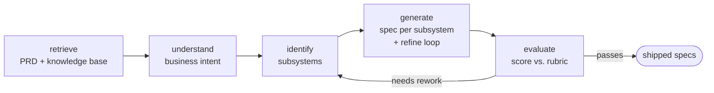

# Porto

**Turn PRDs into engineering specs — grounded in your real codebase.**

Porto is a codebase-aware requirements engineering workbench. Feed it a product requirement doc and it runs a fixed, fully observable workflow that decomposes the requirement into subsystem specs — each one refined by an evaluator-optimizer loop, and each one grounded in the systems, modules, and APIs you already have.

[English](README.md) · [简体中文](README.zh-CN.md)

---

## What is Porto?

Turning a PRD into engineering specs is slow, inconsistent, and disconnected from the codebase that's supposed to implement it. The decomposition lives in one person's head, subsystems get re-cut every sprint, and the resulting specs read like generic boilerplate that ignores your actual code.

Porto turns that into a repeatable pipeline. Give it a PRD and it:

1. **Retrieves** relevant context from a knowledge base built from your code.
2. **Understands** the business intent behind the requirement.
3. **Identifies** the subsystems that should change.
4. **Generates** a spec per subsystem, then critiques and refines each one against a rubric.
5. **Evaluates** the result, reworking it if the quality bar isn't met.

Because Porto reasons over a knowledge base produced by its companion project [**SCV**](https://github.com/ProjAnvil/SCV) — not your raw source — the specs reference your real modules and boundaries instead of inventing them.

## Why Porto?

- 🧠 **Grounded in your codebase** — Porto retrieves from a knowledge base built by [SCV](https://github.com/ProjAnvil/SCV), so specs reflect the systems and APIs you actually have, not generic templates.
- 🔁 **Specs that refine themselves** — every spec runs through a generate → critique → refine loop scored on a 12-point rubric. In our evals, template-grade specs (3.2/12) come out at **11.4/12** after the loop.
- 🔍 **Fully observable** — every step (retrieval, tool calls, critique scores, rework decisions) is recorded as an agent step, so you can trace exactly how each spec was produced.
- 🛡️ **Runs without an API key** — every LLM call has a deterministic fallback. Develop and test end-to-end with zero keys, then plug in a model to scale quality. The model is a quality amplifier, not an on/off switch.

## How it works

Porto is a fixed workflow skeleton with agentic nodes: the path is predictable, but each node uses a tool-calling loop to fetch what it needs.



For a deep dive into the architecture — the LLM client, tool-calling loop, evaluator-optimizer spec loop, memory compaction, and the graceful-degradation philosophy — see the **[Backend Agent Guide](docs/backend-agent-guide.md)**.

## Quickstart

You need Python 3.12 (with [`uv`](https://docs.astral.sh/uv/)) and Node.js.

```bash
# Backend — FastAPI + LangGraph agent (port 8100)
cd backend && uv sync && cp .env.example .env
uv run uvicorn porto_chatbot.main:app --reload --port 8100

# Frontend — Next.js + React workbench (another terminal)
cd frontend && npm install && npm run dev
```

Or, using the provided Makefile:

```bash
make backend-dev    # hot-reloading backend
make frontend-dev   # hot-reloading frontend
make start          # start both at once
```

Open the frontend at the URL `next dev` prints. By default it proxies `/api` to `http://127.0.0.1:8100`.

Porto runs out of the box without any model API key (fallback paths kick in). To unlock full quality, set a provider in `backend/.env` — see **[Deployment & Configuration](docs/deployment.md)** for every option, Docker, and the bundled single-port deployment.

## Ecosystem · SCV

Porto doesn't read your source directly — it reasons over a knowledge base built by [**SCV (Source Code Vault)**](https://github.com/ProjAnvil/SCV).

SCV is a Claude Code skill that analyzes codebases and produces structured documentation: a **README**, **Summary**, **Architecture** (with Mermaid diagrams), and **File Index** per repository. It batches many repos in parallel with isolated subagents, skips repos whose HEAD hasn't changed, and — via [codebones](https://github.com/creynir/codebones) integration — extracts structural skeletons for roughly **85% token reduction** during deep analysis.

> **SCV makes the AI understand your code; Porto makes the AI turn requirements into specs from that understanding.**

If you maintain multiple repositories, point SCV at them once and Porto stays grounded in your ever-evolving codebase. → **[github.com/ProjAnvil/SCV](https://github.com/ProjAnvil/SCV)**

## Documentation

- **[Backend Agent Guide](docs/backend-agent-guide.md)** — how the agent works internally, layer by layer
- **[Deployment & Configuration](docs/deployment.md)** — environment variables, Docker, bundled vs. split deployment
- **[Plans](docs/PLANs/)** · **[TODOs](docs/TODOs/)** — roadmap and open work
- **[Specs](docs/superpowers/specs/)** — design documents

---

 Porto is part of the [ProjAnvil](https://github.com/ProjAnvil) toolkit. Built for teams that ship specs, not guesswork.
