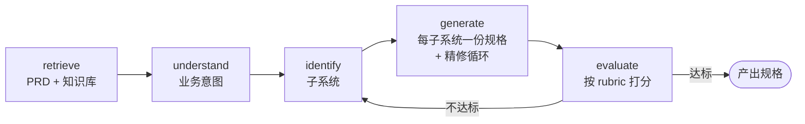

# Porto

**把 PRD 变成工程可执行的规格——而且 grounded 在你真实的代码库上。**

Porto 是一个代码库感知的需求工程工作台。给它一份产品需求文档（PRD），它会跑一条固定、全程可观察的工作流，把需求分解成子系统规格（spec）——每份规格都经过 evaluator-optimizer 循环精修，并且都基于你已有的系统、模块和 API。

[English](README.md) · [简体中文](README.zh-CN.md)

---

## Porto 是做什么的？

把 PRD 变成工程规格，这件事向来又慢、又随意、还和你真正要写的代码脱节。分解过程只活在某一个人的脑子里，子系统边界每个 sprint 都被重新切一遍，产出的规格读起来像通用模板，完全无视你现有的代码。

Porto 把这件事变成一条可重复的流水线。给它一份 PRD，它会：

1. **Retrieve（检索）** 从你的代码构建的知识库里取相关上下文。
2. **Understand（理解）** 搞懂需求背后的业务意图。
3. **Identify（识别）** 找出应该改动的子系统。
4. **Generate（生成）** 为每个子系统生成一份规格，再按 rubric 打分、精修。
5. **Evaluate（评估）** 评估整体结果，不达标就返工。

因为 Porto 推理所依据的是它的姐妹项目 [**SCV**](https://github.com/ProjAnvil/SCV) 构建的知识库——而不是你的原始源码——所以产出的规格会引用你真实的模块和边界，而不是凭空捏造。

## 为什么用 Porto？

- 🧠 **代码库感知** —— Porto 从 [SCV](https://github.com/ProjAnvil/SCV) 构建的知识库里检索，规格反映你真实存在的系统和 API，而非通用模板。
- 🔁 **规格自我精修** —— 每份规格都跑 generate → critique → refine 循环，按 12 分 rubric 打分。实测模板级规格（3.2/12）经循环后达到 **11.4/12**。
- 🔍 **全程可解释** —— 每一步（检索、工具调用、评分、返工决策）都作为 agent step 记录在案，你能精确回溯每份规格是怎么来的。
- 🛡️ **无 API key 也能跑** —— 每个 LLM 调用都有确定性降级路径。零 key 也能端到端开发和测试，再插入模型放大质量。模型是质量放大器，不是功能开关。

## 工作原理

Porto 是「固定 workflow 骨架 + 节点内 agentic」：路径可预测，但每个节点内部用 tool-calling loop 按需取数。



想要深入架构——LLM 客户端、tool-calling loop、evaluator-optimizer 规格循环、memory compaction、降级哲学——请看 **[后端 Agent 架构指南](docs/backend-agent-guide.md)**。

## 快速开始

需要 Python 3.12（带 [`uv`](https://docs.astral.sh/uv/)）和 Node.js。

```bash
# 后端 —— FastAPI + LangGraph agent（端口 8100）
cd backend && uv sync && cp .env.example .env
uv run uvicorn porto_chatbot.main:app --reload --port 8100

# 前端 —— Next.js + React 工作台（另开一个终端）
cd frontend && npm install && npm run dev
```

或者用自带的 Makefile：

```bash
make backend-dev    # 热重载后端
make frontend-dev   # 热重载前端
make start          # 一键同时起前后端
```

在 `next dev` 打印的地址打开前端。前端默认把 `/api` 代理到 `http://127.0.0.1:8100`。

Porto 不配任何模型 key 也能直接跑起来（自动走降级路径）。要解锁完整质量，在 `backend/.env` 配一个 provider——所有配置项、Docker、单端口捆绑部署见 **[部署与配置](docs/deployment.md)**。

## 生态 · SCV

Porto 并不直接读你的源码——它推理依据的是 [**SCV（Source Code Vault）**](https://github.com/ProjAnvil/SCV) 构建的知识库。

SCV 是一个 Claude Code 技能，能分析代码库并产出结构化文档：每个仓库一份 **README**、**Summary**、**Architecture**（含 Mermaid 图）和 **File Index**。它用隔离的 subagent 并行批量分析多个仓库，跳过 HEAD 未变的仓库，并通过 [codebones](https://github.com/creynir/codebones) 提取结构骨架，深度分析时 **token 量约降到 1/6（节省 ~85%）**。

> **SCV 让 AI 懂你的代码；Porto 让 AI 基于这份理解把需求变成规格。**

如果你维护多个仓库，用 SCV 扫一次，Porto 就能持续 grounded 在你不断演进的代码库上。 → **[github.com/ProjAnvil/SCV](https://github.com/ProjAnvil/SCV)**

## 文档

- **[后端 Agent 架构指南](docs/backend-agent-guide.md)** —— 逐层拆解 agent 内部如何运转
- **[部署与配置](docs/deployment.md)** —— 环境变量、Docker、捆绑部署 vs 前后端分离部署
- **[Plans](docs/PLANs/)** · **[TODOs](docs/TODOs/)** —— 路线图与待办
- **[Specs](docs/superpowers/specs/)** —— 设计文档

---

 Porto 是 [ProjAnvil](https://github.com/ProjAnvil) 工具集的一部分。为那些「交付规格、而不是交付猜测」的团队而做。
