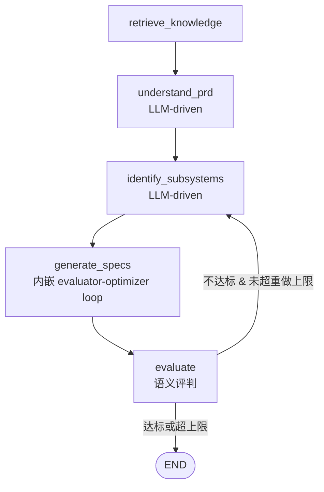

# Backend Agent 架构现代化（激进版 v2）

| 日期 | 2026-07-12 |
|------|------------|
| 版本 | **v2（激进版）** — 用户授权"大刀阔斧改动"，推翻 v1 的"主干不变"约束 |
| 状态 | Approved（开工中） |
| 范围 | `chatbot/backend/src/porto_chatbot/` 全部 |
| 关联 | [TODOs/2026-07-12-spec-refine-loop-and-agent-modernization.md](../TODOs/2026-07-12-spec-refine-loop-and-agent-modernization.md) |

> **v1 → v2 的变化**：v1 只在 `generate_specs` 节点内嵌局部 loop，把 tool calling / agent loop / memory / streaming 列为"范围外"。v2 把这些全部纳入主线——把固定线性 DAG 改造为 **LangGraph 条件图 + 节点内 tool calling 的 agentic workflow**。唯一保留的硬约束：**无 LLM 配置时系统仍能跑**（降级到规则/模板路径）。

---

## 1. 目标

把 backend 从"嵌在固定流水线里的文本补全函数"改造成"LLM 驱动的 agentic workflow"：

- 业务**语义阶段**保留（PRD 分解仍是 理解→识别→生成→评估），但**实现全面 LLM 驱动**——干掉 `DOMAIN_HINTS` 关键词字典、干掉 `understand_prd` 的正则 fallback 主导、干掉 `_render_spec` 的 f-string 模板。
- **DAG 拓扑可改**：`evaluate` 不达标时可条件回边到上游重做（不再是一条直线）。
- spec 生成用 **evaluator-optimizer loop**（v1 核心，保留并扩大）。
- 节点内 LLM 用 **tool calling** 自主取数，而非硬编码取数顺序。
- 引入 memory **compaction**、**native streaming**、intent **LLM router**。

## 2. 研究依据（为什么这样改）

| 来源 | 支撑的决策 |
|------|-----------|
| [Anthropic — Building Effective Agents](https://www.anthropic.com/engineering/building-effective-agents) | 区分 workflows（可预测路径）vs agents（LLM 自主决策）；允许两者混合。本方案=workflows 的骨架 + agentic 的节点 + 条件回边 |
| [Anthropic — Effective Context Engineering](https://www.anthropic.com/engineering/effective-context-engineering-for-ai-agents) | agent = "LLMs autonomously using tools in a loop"；just-in-time 检索；sub-agent 隔离 context |
| [Anthropic — Evaluator-Optimizer](https://platform.claude.com/cookbook/patterns-agents-evaluator-optimizer) | spec loop 的模式来源；**官方示例缺 max-iter guard，本方案补齐四重终止** |
| [Self-Refine (NeurIPS 2023)](https://arxiv.org/abs/2303.17651) | 结构化生成迭代提升 ~13%，支撑 spec loop |

## 3. 现状短板（改造起点）

| 文件 | 问题 |
|------|------|
| [agent.py:326](../../backend/src/porto_chatbot/agent.py#L326) `_render_spec` | f-string 模板，**没调 LLM** |
| [agent.py:161](../../backend/src/porto_chatbot/agent.py#L161) `identify_subsystems` | `DOMAIN_HINTS` 关键词字典硬匹配，泛化差 |
| [agent.py:125](../../backend/src/porto_chatbot/agent.py#L125) `understand_prd` | LLM 失败即退回正则 `_extract_bullets`，质量低 |
| [evaluation.py:11](../../backend/src/porto_chatbot/evaluation.py#L11) `evaluate_workflow` | 纯结构校验，无语义评判 |
| [llm.py:28](../../backend/src/porto_chatbot/llm.py#L28) `complete` | 单次 system+user，无 multi-turn / structured / tool / streaming |
| [agent.py:93](../../backend/src/porto_chatbot/agent.py#L93) `_build_graph` | 线性 DAG，无回边 |
| [intent.py](../../backend/src/porto_chatbot/intent.py) | 正则+关键词路由，脆弱 |
| [memory.py](../../backend/src/porto_chatbot/memory.py) | 无 compaction，长会话撑爆 context |

## 4. 目标架构

### 4.1 LangGraph 条件图（替代线性 DAG）



- 回边目标默认回 `identify_subsystems`（重新拆分）；若仅 spec 质量问题可只回 `generate_specs`（由 evaluate 输出决定）。
- 重做上限 `workflow_rework_max_passes`（默认 1），防死循环。

### 4.2 节点内 tool calling

每个节点内的 LLM 不是单次补全，而是**带 tools 的 mini agent loop**。统一定义工具集（Phase 0 落地）：

| tool | 作用 | 供哪个节点用 |
|------|------|-------------|
| `search_knowledgebase(query, top_k)` | 检索知识库 | understand / identify / generate |
| `get_prd_text()` | 读 PRD 原文 | 全节点 |
| `get_understanding()` | 读 step1 产物 | identify / generate |
| `list_subsystems()` | 读 step2 产物 | generate / evaluate |
| `get_subsystem(name)` | 读单个子系统定义 | generate |
| `get_sources(query)` | 取相关 sources | generate |

节点内 loop 由 LLM 自主决定调哪些 tool、调几次（受限 max_tool_turns）。

### 4.3 设计原则（v2）

1. **业务语义阶段保留**，DAG 拓扑与节点实现均可改。
2. **唯一硬约束**：无 LLM 配置时降级到规则/模板路径，系统不崩。
3. **分阶段落地**，每阶段独立可测、可合并。
4. **可观测**：每个 agentic 决策（tool call、loop 迭代、回边）进 `AgentStep.data` + 结构化日志。

## 5. Spec Refine Loop（核心，保留 v1 设计）

### 5.1 Rubric（6 维 × 0–2 分，满分 12）

覆盖度 / API 规范性 / 数据模型完整性 / 依赖与边界 / 可验证性 / 一致性。≥ `spec_refine_pass_score`（默认 10）为 PASS，7–9 NEEDS_IMPROVEMENT，≤6 FAIL。常量化为 `SPEC_RUBRIC`，同时用于 critic prompt 与单测断言。

### 5.2 Loop + 四重终止

```python
def generate_spec_with_loop(ctx, subsystem, *, max_iter) -> SpecResult:
    spec = generate_initial_spec(ctx, subsystem)
    best, best_score = spec, -1
    for i in range(1, max_iter + 1):
        c = critique_spec(ctx, subsystem, spec)            # 结构化 {verdict,score,feedback}
        if c.verdict == PASS: break                         # ① 达标
        if c.score <= best_score: spec = best; break        # ③ 不升回退
        best, best_score = spec, c.score
        if budget_exceeded(): break                         # ④ 预算
        spec = refine_spec(ctx, subsystem, spec, c.feedback)
    # ② max_iter 由 for 自然截断
    return SpecResult(final=spec, attempts=..., iterations=..., truncated=...)
```

- context 只传「最新 spec + 结构化 feedback + rubric」，不堆历史（防膨胀）。
- critic 默认走更便宜的 `critic_*` 模型。
- subsystem 间并行（`spec_refine_parallel`）。

## 6. 分阶段计划

### Phase 0 — LLM 基础设施 + 工具层（地基，所有后续依赖）
- `llm.py`：`complete` 支持 multi-turn messages；新增 `complete_structured`（JSON/XML 解析+重试）、`complete_with_tools`（tool calling loop）、`stream`（native token 级）
- 新增 `tools.py`：定义 §4.2 工具集 + tool calling 适配（openai/anthropic 两套）
- `settings.py`：新增 `critic_*` / `spec_refine_*` / `workflow_rework_*` / `agent_stream_enabled` 字段
- 单测：每条新路径 + 降级返回

### Phase 1 — understand + identify 改 LLM 驱动
- `understand_prd`：LLM 调 `search_knowledgebase`/`get_prd_text` 生成业务理解；正则降级保留但不主导
- `identify_subsystems`：LLM 输出结构化子系统列表；删 `DOMAIN_HINTS` 主导路径（保留作降级）
- 单测：LLM mock 正常/异常/降级三态

### Phase 2 — Spec evaluator-optimizer loop（§5）
- 新增 `specs.py`：`SPEC_RUBRIC` + `generate_initial_spec` / `critique_spec` / `refine_spec` / `generate_spec_with_loop`
- `models.py`：`Verdict` / `SpecAttempt` / `SpecResult`
- `agent.py` `generate_specs` 节点改用 loop，并行，写 `AgentStep.data`
- 单测：四重终止 + 降级

### Phase 3 — Evaluate 语义化 + 条件回边
- `evaluate_workflow`：聚合 rubric 分数，LLM 可选做整体一致性评判
- `_build_graph`：加 `evaluate → identify/generate` 条件回边（`workflow_rework_enabled`，带上限）
- 单测：回边触发/不触发/超上限

### Phase 4 — Memory compaction
- `memory.py`：会话超阈值时摘要压缩（compaction），保留近期原文 + 远期摘要
- token 预算感知（拼 context 前估算）
- 单测：超阈触发 compaction、检索仍命中

### Phase 5 — Native streaming + Intent 升级
- `main.py` `/api/chat/stream`：LLM 原生 token stream → SSE delta（替代"算完再切块"）
- `intent.py`：升级为 LLM function-calling router（降级保留规则）
- 单测：流式分片、intent 路由准确

## 7. 风险与缓解

| 风险 | 缓解 |
|------|------|
| Loop / 回边死循环 | spec 四重终止 + `workflow_rework_max_passes` |
| LLM 调用量与成本暴涨 | 并行 + critic 用快模型 + 全部带开关 + 预算上限 |
| critic 与 generator 同模型自吹 | critic prompt 强制"只评不解题"；可配独立 `critic_provider` |
| 大改引入回归 | 分阶段，每阶段单测 + 现有 `pytest` 全绿才进下一步；无 LLM 降级路径全程保留 |
| 对外 API 契约变化 | `WorkflowResponse` 字段只增；若必须 breaking，同步改前端 |

## 8. 验收

- 每阶段 `pytest` 全绿，新增模块覆盖率 ≥ 80%
- 无 API key 时系统行为与现状一致（降级路径）
- 对照基线：开启 agentic + loop 后，spec rubric 均分显著高于改造前
- 结构化日志能还原任一 workflow 的全部 tool call / loop 迭代 / 回边决策

## 9. 参考资料

- [Building Effective Agents — Anthropic](https://www.anthropic.com/engineering/building-effective-agents)
- [Effective Context Engineering — Anthropic](https://www.anthropic.com/engineering/effective-context-engineering-for-ai-agents)
- [Evaluator-Optimizer — Anthropic Cookbook](https://platform.claude.com/cookbook/patterns-agents-evaluator-optimizer)
- [Self-Refine — arXiv:2303.17651](https://arxiv.org/abs/2303.17651)
- [Context Engineering — LangChain](https://www.langchain.com/blog/context-engineering-for-agents)
