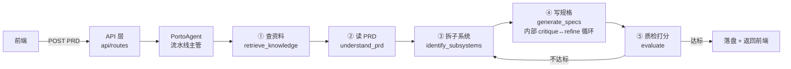

# Porto Chatbot 后端 Agent 系统 · 小白导览

> 写给第一次接触这套后端的同学。假设你懂一点 Python，但没碰过 LLM agent。
> 读完你能知道：这套东西在干嘛、一个请求是怎么从头跑到尾的、每一层（layer）是做什么的、想改代码该去哪里找。

---

## 1. 这系统到底是干嘛的？

一句话：**你丢给它一份 PRD（产品需求文档），它给你吐回一堆「子系统规格说明书」。**

比如你贴一段"我要做个支付平台，要支付、退款、风控、通知……"，它会：

1. 读懂这份需求
2. 拆成几个子系统（支付服务、风控服务、通知服务……）
3. 给每个子系统写一份规格文档（API 需求、数据模型、验收标准……）

中间这个过程是**固定流程**（永远是 理解→拆分→写规格→检查 这几步），但每一步内部是**LLM 在干活**，而且写规格那一步还会"写完自己审、审完自己改"循环好几轮。

---

## 2. 一张图看懂：一个请求的旅程

用户在前端点一下"分解 PRD" →



注意 ⑤ 那条"不达标→回到③"的回箭头：这是这套系统的一个关键设计——**质检不过就返工重拆**，不是一条道跑到黑。

---

## 3. 各层（layer）逐个讲

把整个系统想象成一家"PRD 分解公司"，每个 layer 是一个岗位。

### 🏢 API 层 — 前台接单（[api/](../backend/src/porto_chatbot/api/)）

**是谁**：FastAPI 写的 HTTP 接口，前端唯一打交道的地方。
**干啥**：接前端的请求（聊天 / 跑 PRD 工作流 / 改设置 / 索引知识库），调后面的 agent，把结果包成 JSON 吐回去。
**怎么玩**：
- 聊天：`POST /api/chat`（一次性返回）、`POST /api/chat/stream`（流式，一字一字吐）
- 跑 PRD：`POST /api/porto/workflows`
- 看日志：所有请求都有结构化日志（带 `workflow_id`，能串起来追）
**代码**：[api/routes/](../backend/src/porto_chatbot/api/routes/) 按业务分文件（chat/workflow/knowledge/memory/settings/eval）。

> 小白重点：前端发的所有东西都从这儿进。要加新接口，在 `api/routes/` 建个文件，挂个 `router`，到 `app.py` 里 `include_router`。

---

### 🛎️ 意图路由 — 分诊台（[intent.py](../backend/src/porto_chatbot/intent.py)）

**是谁**：判断用户这句话到底想干嘛。
**干啥**：聊天时（不是跑 PRD 时），把用户消息分成两类——
- `direct`：寒暄/闲聊（"你好"、"谢谢"）→ 直接回，不查知识库
- `rag`：真问题（"支付怎么拆"、"查一下风控"）→ 走完整 RAG 流程

**怎么玩**：优先用 **LLM 判断**（更准）；LLM 没配 key 时退回**关键词规则**（"支付""风控"这些词触发 rag）。
**为什么这样**：闲聊也去查知识库又慢又蠢。先分诊，省事。

> 小白重点：加新的"闲聊词"不用改代码——只要 LLM 配了，它会自己判断。没配 LLM 才需要改 `RAG_HINTS` 关键词。

---

### 📞 LLM 客户端 — 和大模型打电话（[llm/](../backend/src/porto_chatbot/llm/)）

**是谁**：封装 OpenAI / Anthropic SDK 的统一客户端。
**干啥**：后面所有 layer 想用大模型，都通过它。它提供四种打牌方式：
- `complete(system, user)` — 最朴素，一问一答
- `complete_with_tools(...)` — **带工具的 agent loop**（大模型可以自己决定调哪个工具，调完再思考，循环到它不再要工具为止）← 这是"agentic"的核心
- `complete_structured(...)` — 让大模型严格吐 JSON（解析失败自动重试一次）
- `stream(...)` — 原生流式，一个字一个字 yield

**怎么玩**：在 `.env` / `.env.test` 配 `LANGCHAIN_API_KEY` / `LANGCHAIN_MODEL` / `LANGCHAIN_BASE_URL`。**没配 key 时所有方法安全返回空**——后面 layer 会自动走降级路径，系统照样跑（只是用规则/模板代替 LLM）。
**代码**：[llm/client.py](../backend/src/porto_chatbot/llm/client.py)。

> 小白重点：这套系统**没配 key 也能跑**（用降级逻辑），这是测试能确定性的关键。你本地没 key 不影响开发。

---

### 🧰 工具层 — agent 的手脚（[tools/](../backend/src/porto_chatbot/tools/)）

**是谁**：大模型在 agent loop 里**能调用的函数**。
**干啥**：大模型本身只会说话，不会查数据库。工具就是给它装的"手"。我们有 6 个：
- `get_prd_text` — 读当前 PRD 原文
- `get_understanding` — 读已生成的业务理解报告
- `list_subsystems` / `get_subsystem` — 看已识别的子系统
- `search_knowledgebase` — 检索知识库
- `get_sources` — 看已检索到的资料

**怎么玩**：每个工具有 JSON schema（告诉大模型怎么调）+ handler（真正执行的函数）。大模型在 `complete_with_tools` 里自己选调哪个、调几次。
**代码**：[tools/registry.py](../backend/src/porto_chatbot/tools/registry.py)（注册）/ [tools/handlers.py](../backend/src/porto_chatbot/tools/handlers.py)（实现）。

> 小白重点：想让 agent 能"看"到新东西？在这里加个工具。比如想让它查数据库，加个 `query_db` 工具。

---

### 🏭 Agent 编排 — 流水线主管（[agent/](../backend/src/porto_chatbot/agent/)）

**是谁**：`PortoAgent`，整个 5 步流水线的指挥。用 LangGraph 把 5 个节点串成图。
**干啥**：一次 `agent.run(prd)` 会依次跑：

| 步骤 | 节点 | 干啥 | 降级（无 LLM 时） |
|------|------|------|------------------|
| ① | `retrieve_knowledge` | 向量检索知识库，捞相关片段 | 仍然检索（不依赖 LLM） |
| ② | `understand_prd` | LLM 读 PRD，写业务理解报告 | 正则抽取关键词拼报告 |
| ③ | `identify_subsystems` | LLM 按领域驱动设计拆子系统 | 关键词字典（`DOMAIN_HINTS`）匹配 |
| ④ | `generate_specs` | LLM 给每个子系统写规格 + **自我循环精修** | f-string 模板拼接 |
| ⑤ | `evaluate` | 结构检查 + spec rubric 打分；**不达标回 ③ 重做** | 只做结构检查 |

**怎么玩**：回边（⑤→③）的次数由 `workflow_rework_max_passes` 控制（默认 1，即最多返工一次）。
**代码**：[agent/graph.py](../backend/src/porto_chatbot/agent/graph.py)（PortoAgent 主体）/ [agent/nodes/](../backend/src/porto_chatbot/agent/nodes/)（5 个节点各一个文件）/ [agent/heuristics.py](../backend/src/porto_chatbot/agent/heuristics.py)（降级用的关键词/正则）。

> 小白重点：流程是**固定的**（业务要求可预测），但每个节点内部是 agentic 的。想改"拆子系统"的逻辑，去 `nodes/identify.py`。

---

### 🔄 规格生成 loop — 写完自己审、审完自己改（[specs/](../backend/src/porto_chatbot/specs/)）

这是整套系统**最核心的创新点**，单独拎出来讲。

**是谁**：④ `generate_specs` 节点内部的一个迷你循环。
**干啥**：对每个子系统，跑这个循环：

```
生成首版 spec
  ↓
┌→ critic 按 6 维 rubric 打分（满分 12）
│   ↓
│  PASS？→ 是 → 接受，结束
│   ↓ 否
│  按 feedback 改一版（refine）
└── 回去再打分
```

**四个终止条件**（防止死循环）：
1. critic 给 PASS（分数 ≥ 10）→ 结束
2. 改到 `max_iter` 次（默认 3）→ 结束
3. **分数不升反降**（越改越差）→ 回退到最好的那版，结束
4. token 预算花光 → 结束

**效果**（实测，deepseek）：模板拼接的 spec 打分 **3.2/12**，这个 loop 后 **11.4/12**——质量地板从"不可用"抬到"接近满分"。

**怎么玩**：
- `spec_refine_enabled` — 总开关
- `spec_refine_max_iter` — 每个子系统最多改几轮
- `spec_refine_pass_score` — 多少分算 PASS
- `spec_refine_budget_tokens` — token 预算上限

**代码**：[specs/loop.py](../backend/src/porto_chatbot/specs/loop.py)（主循环）/ [specs/steps.py](../backend/src/porto_chatbot/specs/steps.py)（生成/评审/修订三步）/ [specs/rubric.py](../backend/src/porto_chatbot/specs/rubric.py)（6 维评分标准）。

> 小白重点：rubric 那 6 个维度（覆盖度/API 规范/数据模型/依赖/可验证性/一致性）是 critic 打分的尺子。想改评判标准，改 `rubric.py`。

---

### 🧠 记忆层 — 会话记忆 + 自动压缩（[memory/](../backend/src/porto_chatbot/memory/)）

**是谁**：聊天场景下的对话记忆。
**干啥**：两路存储——
- SQLite：存每条对话原文（按 session）
- ChromaDB：把对话向量化，能按语义检索相关历史

**关键招式 · compaction（压缩）**：会话一长，把所有历史塞进 prompt 会撑爆 context 窗口。所以超过阈值（默认 20 条）时：
- 把**旧消息**让 LLM 摘要成一段（缓存到 db，下次复用）
- 只把**最近几条**（默认 8）保留原文
- 拼 prompt 时：摘要 + 近期原文

**怎么玩**：
- `memory_compact_threshold` — 多少条消息触发压缩
- `memory_recent_keep` — 保留最近几条原文

**代码**：[memory/store.py](../backend/src/porto_chatbot/memory/store.py)（存储）/ [memory/compaction.py](../backend/src/porto_chatbot/memory/compaction.py)（压缩逻辑）。

> 小白重点：聊天场景才用记忆（`/api/chat`）。跑 PRD 工作流不用（它是无状态的一锤子买卖）。

---

### ⚡ 流式输出 — 边想边说（[api/routes/chat.py](../backend/src/porto_chatbot/api/routes/chat.py) 的 `chat_stream`）

**是谁**：`/api/chat/stream` 的 SSE 流式接口。
**干啥**：LLM 生成答案时，**一个 token 一个 token 往前端推**（不是等整段算完才发），首字延迟低很多。
**怎么玩**：`agent_stream_enabled` 开关。关了就用老的"算完再切块发"（假流式）。协议是 AI SDK 的 SSE 格式（`text-delta` / `source-document` / `data-porto` / `finish`），前端要按这个解析。
**降级**：LLM 没配 key 时自动退回非流式。

---

## 4. 怎么玩起来（上手三步）

### 第 1 步：装环境

```bash
cd chatbot/backend
uv sync          # 装依赖
```

### 第 2 步：配 LLM（可选，不配也能跑）

```bash
cp .env.example .env
# 编辑 .env，填上你的 key：
# LANGCHAIN_AGENT_PROVIDER=openai
# LANGCHAIN_API_KEY=sk-xxx
# LANGCHAIN_MODEL=gpt-4.1-mini
# LANGCHAIN_BASE_URL=            # 走代理才填
```

> 国内常用 deepseek / 通义等兼容 OpenAI 协议的，把 `LANGCHAIN_BASE_URL` 填它们的地址、`LANGCHAIN_MODEL` 填对应模型名即可。

### 第 3 步：跑

```bash
uv run uvicorn porto_chatbot.main:app --reload   # 起后端
```

前端单独 `cd ../frontend && npm i && npm run dev`。

**不配 key 也能跑**——所有 LLM 步骤走降级（模板/规则），功能完整，只是质量低。这就是为啥本地开发很轻。

---

## 5. 想改代码，去哪儿找？

| 我想…… | 改这里 |
|--------|--------|
| 加一个 HTTP 接口 | [api/routes/](../backend/src/porto_chatbot/api/routes/) 新建文件 |
| 改意图判断规则 | [intent.py](../backend/src/porto_chatbot/intent.py) 的 `_rule_route` |
| 换 LLM 调用方式 | [llm/client.py](../backend/src/porto_chatbot/llm/client.py) |
| 给 agent 加新工具 | [tools/registry.py](../backend/src/porto_chatbot/tools/registry.py) |
| 改某个流程节点 | [agent/nodes/](../backend/src/porto_chatbot/agent/nodes/) 对应文件 |
| 改 spec 评分标准 | [specs/rubric.py](../backend/src/porto_chatbot/specs/rubric.py) |
| 调 spec loop 行为 | [specs/loop.py](../backend/src/porto_chatbot/specs/loop.py) + `Settings` 的 `spec_refine_*` |
| 改记忆/压缩 | [memory/](../backend/src/porto_chatbot/memory/) |
| 加配置项 | [settings.py](../backend/src/porto_chatbot/settings.py) + [models/payload.py](../backend/src/porto_chatbot/models/payload.py) + 前端 [types.ts](../frontend/src/lib/types.ts) |

**改完一定跑测试**：
```bash
cd chatbot/backend && uv run pytest
```
现在 96 个测试，全绿才能算改完。

---

## 6. 几个坑（踩过才知道）

1. **没配 key 不是 bug**。系统设计成无 key 降级，测试也靠这个保持确定性。看到 LLM "没生效"先检查 `.env`。

2. **`validation_alias` 的坑**。`agent_api_key` 这类字段在 [settings.py](../backend/src/porto_chatbot/settings.py) 用了 `validation_alias="LANGCHAIN_API_KEY"`，意思是它从 `LANGCHAIN_API_KEY` 环境变量读。两个副作用：
   - 构造时 `Settings(agent_api_key="k")` **不生效**（要用 `setattr`）
   - 环境变量有值时，会覆盖代码里的 `setattr`
   - 所以测试里用 `monkeypatch.delenv` 把这些 env 清掉，保证测试确定性。

3. **配置三套，别搞混**：
   - `.env` — 生产/本地开发
   - `.env.test` — 跑基线评估脚本（[scripts/spec_baseline_eval.py](../backend/scripts/spec_baseline_eval.py)）用；pytest 单元测试会**隔离**它的 LLM key（保持确定性）
   - 前端 Settings 页 — 存到 sqlite（`~/.porto/settings.sqlite3`），优先级介于 env 和默认值之间

4. **critic 模型可以单独配**。想用便宜模型当评审、贵模型当生成？配 `critic_provider` / `critic_model`（前端「高级配置」面板）。不配就复用 generator。

5. **spec loop 不是越多轮越好**。`max_iter` 默认 3 已经够（实测能到 11+ 分）。设太大浪费钱，而且有"分数不升就停"的保护防止越改越差。

---

## 7. 还想深挖？

- 整体改造方案与决策：[PLANs/2026-07-12-spec-refine-loop-and-agent-modernization.md](PLANs/2026-07-12-spec-refine-loop-and-agent-modernization.md)
- 任务清单（全勾完）：[TODOs/2026-07-12-spec-refine-loop-and-agent-modernization.md](TODOs/2026-07-12-spec-refine-loop-and-agent-modernization.md)
- 跑基线对照（看 loop 比 template 好多少）：`uv run python scripts/spec_baseline_eval.py`

有具体问题，直接读对应 layer 的代码——每个文件顶部都有注释说明它在干嘛。
