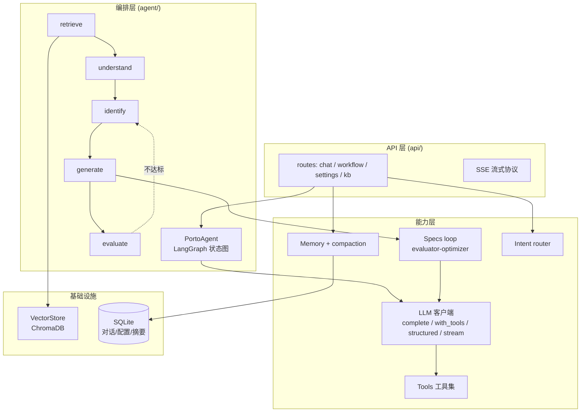
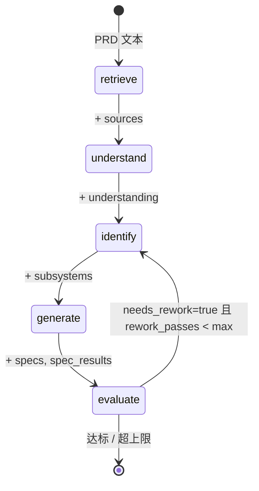
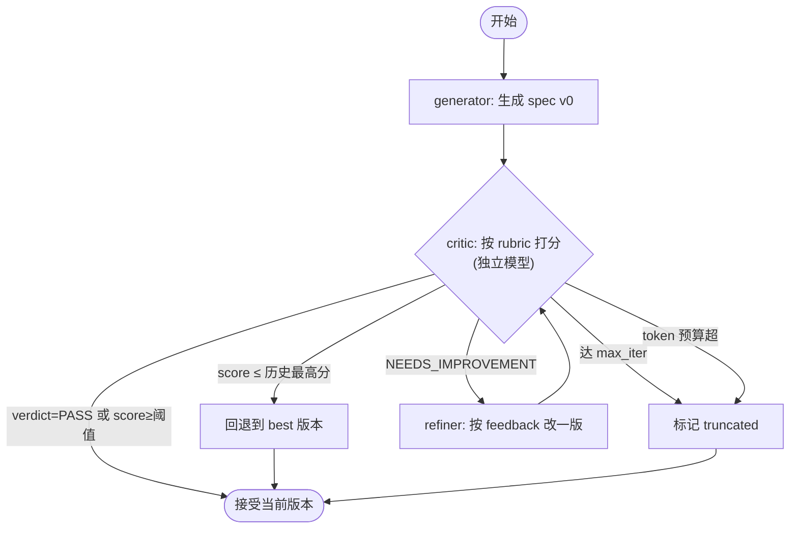
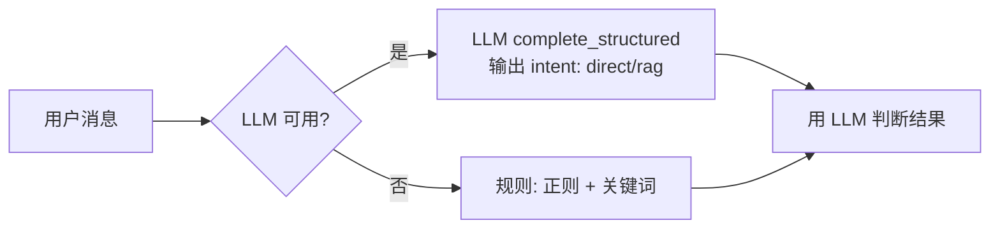
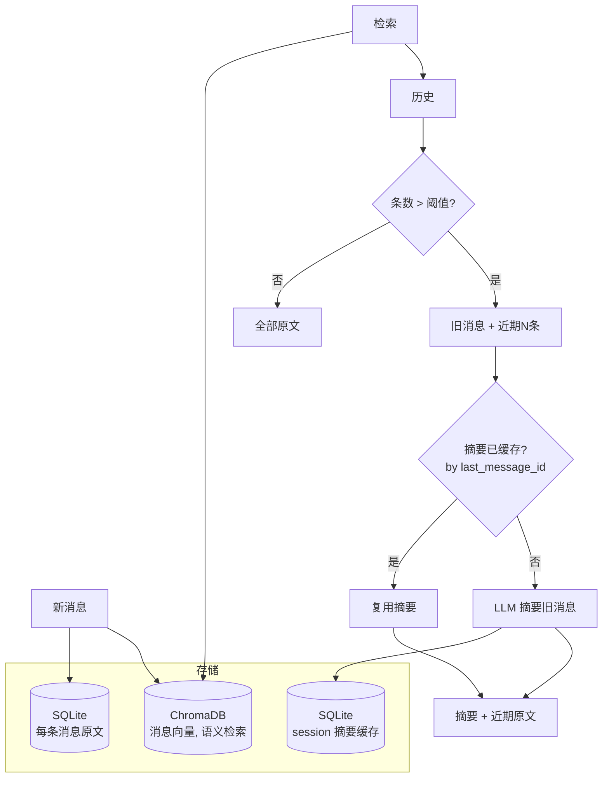
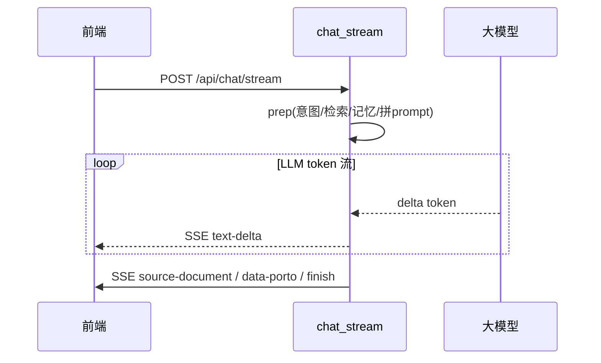

# Porto Chatbot 后端 · Agent 架构运作机制

> 受众：会写代码、刚接触 LLM agent 的开发者。
> 本文不讲"怎么用"，讲**每个 layer 背后在怎么运转、为什么这么设计**，以及它对应业界哪些 agent 概念。读完你能理解这套系统是怎么把"固定流程"和"LLM 自主性"焊在一起的。

---

## 0. 先定位：这是个什么类型的 agent？

业界（参考 [Anthropic — Building Effective Agents](https://www.anthropic.com/engineering/building-effective-agents)）把 LLM 系统分两类：

- **Workflow**：路径预先编排好，LLM 在固定位置被调用。可预测、好调试。
- **Agent**：LLM 自己决定下一步做什么（调什么工具、何时停）。灵活、但不可控。

这套系统是两者的混合：**固定 workflow 骨架 + 节点内部 agentic**。

```
骨架（workflow，固定）：retrieve → understand → identify → generate → evaluate
                                              ↑                          │
                                              └── 不达标回边（条件）──────┘

每个节点内部（agentic）：LLM 用 tool-calling loop 自主取数、用 evaluator-optimizer loop 自我精修
```

为什么这么选？产品需求是"把 PRD 分解成规格"——**步骤必须可预测**（用户要确定的分解过程），但每一步的**内容生成**又需要 LLM 的灵活。所以骨架锁死、节点内放开。

---

## 1. 分层全景



数据流：**API → 编排层（跑 graph）→ 能力层（调 LLM/工具/记忆）→ 基础设施**。回边在编排层内闭环。

---

## 2. LLM 客户端层：一个客户端，四种调用模式

[llm/client.py](../backend/src/porto_chatbot/llm/client.py) 把 OpenAI / Anthropic 两套 SDK 抽象成统一接口，提供**四种语义不同的调用**——这四种覆盖了 agent 开发里几乎所有 LLM 用法：

| 方法 | 机制 | 用在哪 | 对应概念 |
|------|------|--------|----------|
| `complete` | 单轮 `system + user` → 文本 | refine、摘要、direct 回答 | 最朴素的补全 |
| `complete_with_tools` | **agent loop**：LLM 反复选工具→执行→回填→再思考 | understand、generate_initial | tool use / function calling |
| `complete_structured` | 强制 JSON 输出 + 解析重试 | identify（拆子系统）、critique（打分） | structured output |
| `stream` | 原生 token 级迭代器 | chat_stream 流式回答 | streaming |

**关键设计：四种方法在 LLM 未配置时全部安全返回空/空迭代器**。这让上层可以用同一个调用写法，`if 返回空: 走降级`。这是"无 key 也能跑"的地基。

---

## 3. Tool calling loop：让 LLM 长出手脚

这是"agentic"的核心机制。`complete_with_tools` 内部跑一个循环：

```mermaid
sequenceDiagram
    participant Node as Agent 节点
    participant Loop as tool-loop (LLMClient)
    participant LLM as 大模型
    participant Exec as 本地 tool 执行器
    Node->>Loop: system + user + tools(schema)
    loop 直到 LLM 不再要工具 或 达到 max_turns
        Loop->>LLM: 当前对话 + 可用工具
        LLM-->>Loop: tool_call(name, args) 或 最终文本
        alt 返回 tool_call
            Loop->>Exec: 调对应 handler(args)
            Exec-->>Loop: 执行结果(字符串)
            Loop->>Loop: 把结果作为 tool_result 回填对话
        else 返回文本
            Loop-->>Node: 最终答案 (退出循环)
        end
    end
```

**运作要点**：

- **工具是给 LLM 的 schema + 给本地的 handler**（[tools/registry.py](../backend/src/porto_chatbot/tools/registry.py)）。LLM 看到 schema 决定调哪个、传什么参数；本地执行 handler 拿到真实数据，再喂回 LLM。
- **LLM 自主决定取数顺序**（just-in-time retrieval）。比如 `understand_prd` 节点不硬编码"先查知识库再读 PRD"，而是把 `get_prd_text` / `search_knowledgebase` 等工具丢给 LLM，它自己判断"这次需要查吗？查什么？"。
- **终止保护**：达到 `max_turns`（默认 4）还在要工具，就强制再调一次无工具的 `complete` 收尾，标 `truncated=True`。防止 LLM 无限调工具。
- **双 provider 适配**：OpenAI 的 `tool_calls` 和 Anthropic 的 `tool_use` block 格式不同，client 内部各有一套解析/回填逻辑，对上层透明。

> 对 agent 新手：这就是"function calling"的工程化实现。所有"LLM 能查数据库/调 API"的能力，本质都是这个循环。

---

## 4. Agent 编排：LangGraph 状态机

[agent/graph.py](../backend/src/porto_chatbot/agent/graph.py) 用 LangGraph 的 `StateGraph` 把 5 个节点串成图。核心机制是 **state 在节点间流转**：



**运作要点**：

- **共享 state**（`PortoAgentState`，TypedDict）：每个节点读 state、算东西、返回**更新后的 state**。LangGraph 负责合并、传给下一节点。`understanding`、`subsystems`、`specs`、`spec_results`、`evaluation`、`rework_passes` 等都在 state 里流转。
- **节点是函数** `(agent, state) -> state`（[agent/nodes/](../backend/src/porto_chatbot/agent/nodes/)），不是方法。graph 用 lambda 绑定 agent 实例后注册。
- **条件回边**：`evaluate` 节点算出 `needs_rework`，`add_conditional_edges` 的 router 读它决定去 `identify` 还是 `END`。`rework_passes` 计数器防止无限回边（默认最多返工 1 次）。
- **每个步骤都写 `AgentStep` 进 state**，最终落到 `WorkflowResponse.steps`，前端 inspector 能还原整个决策链。

> 为什么用 LangGraph 而不是手写循环？因为条件回边、状态合并、节点重试这些自己写又脏又容易错。LangGraph 把"状态机"这件事做对了。

---

## 5. Spec evaluator-optimizer loop：自我精修

这是整套系统**最值得学的设计**，位于 [specs/loop.py](../backend/src/porto_chatbot/specs/loop.py)。`generate` 节点内部，对每个子系统跑：



**运作要点（每个都对应一个工程教训）**：

1. **critic 和 generator 分离**。critic 的 prompt 强制"只评审、不重写"——防止 LLM 自己写的东西自己审时"自吹自擂"。它们甚至可以用不同模型（`critic_*` 配置，让便宜快速的模型当评审）。

2. **rubric 是结构化的**（[specs/rubric.py](../backend/src/porto_chatbot/specs/rubric.py)）：6 个维度（覆盖度/API 规范/数据模型/依赖/可验证性/一致性），每维 0-2 分，满分 12。critic 用 `complete_structured` 输出 `{verdict, score, feedback, per_dimension}`。结构化让分数可比较、可终止判断。

3. **四重终止**（参考 [Anthropic evaluator-optimizer](https://platform.claude.com/cookbook/patterns-agents-evaluator-optimizer)，官方示例只有"PASS 才停"会死循环）：
   - PASS（达标）
   - `max_iter`（默认 3 轮）
   - **分数不升回退**（本次分数 ≤ 历史最高 → 越改越差，立刻停，用 best 版本）← 防震荡
   - token 预算（防失控烧钱）

4. **per-subsystem 并行**。子系统间相互独立，用 `ThreadPoolExecutor` 并行跑各自的 loop。

5. **context 不堆历史**。每次 refine 只传「最新 spec + 结构化 feedback + rubric」，不把所有历史版本塞进 prompt（那会撑爆窗口且干扰）。

**实测效果**（deepseek）：模板拼接 spec 打 3.2/12，loop 后 11.4/12。这就是 evaluator-optimizer 模式的价值。

---

## 6. Intent router：LLM-as-router

[intent.py](../backend/src/porto_chatbot/intent.py)。聊天入口先判断"这句话要不要走 RAG"：



**运作要点**：
- 用 `complete_structured` 让 LLM 输出 `{intent, reason}`，本质是**用 LLM 当分类器**（LLM-as-a-judge 的一种）。
- 降级是规则（正则匹配寒暄词、关键词触发 rag）。规则的好处是确定性、零成本；LLM 的好处是泛化（"帮我瞅瞅这方案靠谱不"这种没关键词的也能判）。
- 两级 fallback：LLM 输出无效（解析失败/枚举外的值）→ 也退回规则。

> 这是"小模型/规则做大决策、LLM 做边缘情况"的典型用法。不是所有判断都要 LLM。

---

## 7. Memory：三层存储 + compaction

[memory/](../backend/src/porto_chatbot/memory/)。聊天场景的记忆，解决"会话长了 context 装不下"的问题。



**运作要点**：

- **三路存储**：原文（按 session 列出）、向量（语义检索相关历史）、摘要缓存（旧消息的压缩态）。
- **compaction 是核心**（[memory/compaction.py](../backend/src/porto_chatbot/memory/compaction.py)）：会话超阈值（默认 20 条）时，把旧消息让 LLM 摘要成一段，只保留近期（默认 8 条）原文。拼 prompt 时用「摘要 + 近期原文」。这是 Anthropic context engineering 里的 **compaction 策略**——避免 `n²` 复杂度的 context 把窗口撑爆。
- **缓存键是 `last_message_id`**：如果旧消息集合没变（没新消息进来），复用上次摘要，不重复调 LLM。新消息进来使旧集合扩大，`last_message_id` 变了，才重新摘要。
- **降级**：LLM 不可用时不压缩，只返回近期原文（信息少但不崩）。

> 对 agent 新手：长会话 agent 必须有 compaction，否则迟早 context 爆。这版是简易实现（按消息数触发、整段摘要），更进阶的可以按 token 数、滑动窗口、分层摘要。

---

## 8. Context engineering：怎么拼 prompt

这套系统在拼接 LLM 输入时遵循一个原则：**只传最小高信号 token**（参考 [Anthropic — Effective Context Engineering](https://www.anthropic.com/engineering/effective-context-engineering-for-ai-agents)）。

聊天 prompt 的拼法（[api/routes/chat.py](../backend/src/porto_chatbot/api/routes/chat.py)）：

```
[用户问题]
[会话历史摘要]   ← 来自 compaction（有才放）
[最近会话原文]   ← recent N 条
[记忆检索]       ← 向量检索相关历史
[知识库片段]     ← RAG 检索
```

加上**预算保护**（`_trim_to_budget`）：总字符超 `context_char_budget`（默认 16000）时，从后向前精确截断——保留问题/摘要/会话，裁掉检索片段。后缀长度计入预算，保证截断后真的不超。

> 这是"context 是有限资源、有边际递减"的工程化。不是什么都要塞进去。

---

## 9. Streaming：原生 token 流

[api/routes/chat.py](../backend/src/porto_chatbot/api/routes/chat.py) 的 `chat_stream`。`agent_stream_enabled` 开时，RAG 分支用 `LLMClient.stream` 原生流式：



**运作要点**：
- prep 阶段（检索/记忆/拼 prompt）是**非流式**的，一次性做完；只有答案生成是流式。首字延迟 ≈ prep 时间 + LLM 首个 token。
- SSE 协议遵循 AI SDK 格式（`text-delta` / `source-document` / `data-porto` / `finish`），前端按这个解析。
- **降级**：`agent_stream_enabled=false` 或 LLM 不可用时，退回 `complete`（算完整段再切块发，假流式）。

---

## 10. 降级哲学：为什么无 key 也全程能跑

贯穿所有 layer 的设计原则：**每个 LLM 调用都有降级路径**。

| Layer | LLM 可用时 | LLM 不可用时（降级） |
|-------|-----------|---------------------|
| understand | LLM 写业务理解报告 | 正则抽关键词拼报告 |
| identify | LLM 按领域设计拆子系统 | `DOMAIN_HINTS` 关键词字典匹配 |
| generate | LLM 生成 + evaluator-optimizer loop | f-string 模板拼接 |
| critique | LLM 按 rubric 打分 | 跳过（直接接受当前 spec） |
| intent | LLM 分类 | 正则 + 关键词 |
| memory compaction | LLM 摘要旧消息 | 只返回近期原文，不压缩 |
| chat answer | LLM 回答 | 列出检索到的片段 |

这带来三个好处：
1. **本地开发零门槛**（不配 key 也能跑通全流程）
2. **测试确定性**（降级路径不调 LLM，结果稳定）
3. **生产容错**（LLM 偶发失败时系统退化而非崩溃）

代价：降级质量明显更低（baseline 实测模板 3.2 vs LLM loop 11.4）。所以 LLM 是"质量放大器"，不是"功能开关"。

---

## 11. 概念对照表：这套实现 ↔ 业界术语

| 本系统 | 业界术语 / 出处 |
|--------|----------------|
| `complete_with_tools` 的循环 | tool use / function calling agent loop |
| `complete_structured` | structured output / JSON mode |
| spec 的 generate→critique→refine | evaluator-optimizer workflow（[Anthropic Cookbook](https://platform.claude.com/cookbook/patterns-agents-evaluator-optimizer)） |
| critic 分数不升就停 | Self-Refine 的防震荡终止（[arXiv:2303.17651](https://arxiv.org/abs/2303.17651)） |
| memory compaction | context engineering 的 compaction（[Anthropic](https://www.anthropic.com/engineering/effective-context-engineering-for-ai-agents)） |
| evaluate→identify 回边 | workflows 的条件路由 / self-correction |
| intent LLM 路由 | LLM-as-a-judge / semantic router |
| 节点内 just-in-time 检索 | just-in-time context loading |
| 固定图 + 节点内 agentic | workflows with agentic nodes（[Building Effective Agents](https://www.anthropic.com/engineering/building-effective-agents)） |

---

## 12. 想看代码

| Layer | 入口文件 |
|-------|---------|
| LLM 客户端 | [llm/client.py](../backend/src/porto_chatbot/llm/client.py) |
| Tool loop 实现 | [llm/client.py](../backend/src/porto_chatbot/llm/client.py) 的 `complete_with_tools` |
| 工具注册 | [tools/registry.py](../backend/src/porto_chatbot/tools/registry.py) |
| Agent 编排 | [agent/graph.py](../backend/src/porto_chatbot/agent/graph.py) |
| 流程节点 | [agent/nodes/](../backend/src/porto_chatbot/agent/nodes/) |
| Spec loop | [specs/loop.py](../backend/src/porto_chatbot/specs/loop.py) |
| Rubric | [specs/rubric.py](../backend/src/porto_chatbot/specs/rubric.py) |
| Intent 路由 | [intent.py](../backend/src/porto_chatbot/intent.py) |
| Memory / compaction | [memory/compaction.py](../backend/src/porto_chatbot/memory/compaction.py) |

每个文件顶部都有注释说明它的角色。建议读顺序：`llm/client.py`（看四种调用）→ `agent/graph.py`（看编排）→ `agent/nodes/understand.py`（看一个节点怎么用 tool loop）→ `specs/loop.py`（看 evaluator-optimizer）。
