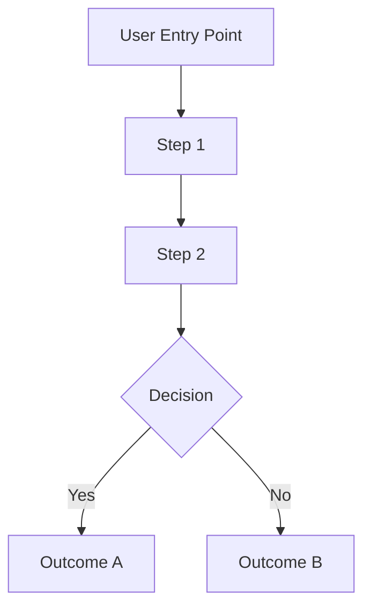
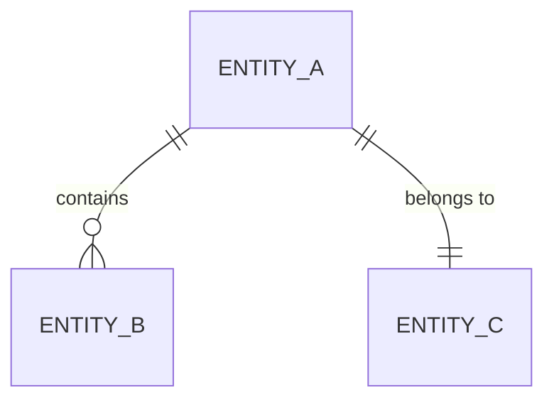

# PRD Decomposition - Step 1: Business Understanding

## Context

This is **Step 1** of the Porto workflow. It reads and analyzes the PRD document to generate a comprehensive understanding report.

**Input**: PRD document path(s)
**Output**: `step1_understanding.md` in the workflow directory

## Instructions

### 1. Read PRD Document

Read all provided PRD files from the `<WORKFLOW_DIR>/inputs/` directory.

### 2. Extract Core Information

Analyze the document and extract:

| Category | What to Extract |
|----------|-----------------|
| **Project Background** | Why are we building this? Business context |
| **Business Objectives** | What goals does this project aim to achieve? |
| **Target Users** | Who will use this system? |
| **Core Business Processes** | How do users interact with the system? |
| **Feature List** | Detailed breakdown of functional requirements |
| **Non-functional Requirements** | Performance, security, scalability needs |
| **Data Entities** | Core business objects and their relationships |
| **Integration Requirements** | External systems to integrate with |
| **Constraints** | Technical or business constraints |

### 3. Identify Subsystem Hints

While analyzing, also identify hints about potential subsystems:

- Business domains mentioned (e.g., "user management", "order processing")
- Existing system references (e.g., "integrate with imed-process")
- Organizational boundaries (e.g., "payment team", "notification team")

### 4. Generate Understanding Report

Create `step1_understanding.md` with the following structure:

```markdown
# Step 1: Business Requirements Understanding

> 📋 Workflow ID: {WORKFLOW_ID}
> 📅 Generated: {TIMESTAMP}
> 📄 Source Documents: {List of input files}

---

## 1. Executive Summary

### 1.1 Project Overview
{2-3 sentences describing what the project is about}

### 1.2 Business Objectives
| Objective | Priority | Success Metric |
|-----------|----------|----------------|
| ... | P0/P1/P2 | ... |

### 1.3 Target Users
{Description of primary and secondary user groups}

---

## 2. Business Process Analysis

### 2.1 Primary User Journey



### 2.2 Alternative Flows
{Edge cases and alternative paths}

### 2.3 Business Rules
| Rule ID | Description | Applies To |
|---------|-------------|------------|
| BR-001 | ... | ... |

---

## 3. Feature Breakdown

### 3.1 Must-Have Features (P0)
| ID | Feature | Description | Acceptance Criteria |
|----|---------|-------------|---------------------|
| F-001 | ... | ... | ... |

### 3.2 Should-Have Features (P1)
{Table format}

### 3.3 Nice-to-Have Features (P2)
{Table format if applicable}

---

## 4. Domain Model Sketch

### 4.1 Core Entities

| Entity | Description | Key Attributes |
|--------|-------------|----------------|
| ... | ... | ... |

### 4.2 Entity Relationships



### 4.3 Data Flow Overview
{High-level data flow description}

---

## 5. Non-Functional Requirements

| Category | Requirement | Metric/Target | Priority |
|----------|-------------|---------------|----------|
| Performance | Response time | < 200ms | P0 |
| Scalability | Concurrent users | 10,000 | P1 |
| Security | Data encryption | AES-256 | P0 |
| Availability | Uptime | 99.9% | P0 |

---

## 6. Integration Requirements

### 6.1 External Systems
| System | Purpose | Integration Type | Priority |
|--------|---------|------------------|----------|
| ... | ... | REST/MQ/Webhook | ... |

### 6.2 Data Exchange
{Description of data exchange requirements}

---

## 7. Subsystem Hints

> 💡 These are initial hints for Step 2. Review and refine during subsystem identification.

| Hint | Source | Suggested Name | Notes |
|------|--------|----------------|-------|
| User management | PRD Section 3.1 | user-service | Authentication, profiles |
| Order processing | PRD Section 4.2 | order-service | Core business logic |
| ... | ... | ... | ... |

---

## 8. Constraints & Assumptions

### 8.1 Technical Constraints
- {List technical constraints}

### 8.2 Business Constraints
- {List business constraints}

### 8.3 Assumptions
- {List assumptions made during analysis}

---

## 9. Questions & Clarifications

> ⚠️ Items that need stakeholder input before proceeding

| ID | Question | Impact | Asked To |
|----|----------|--------|----------|
| Q-001 | ... | Blocks subsystem design | Product Owner |

---

## Next Steps

After reviewing this document:

1. **Edit if needed**: `~/.porto/workflows/{WORKFLOW_ID}/step1_understanding.md`
2. **Continue to Step 2**: Run `/porto.continue` to identify subsystems
3. **Ask questions**: Address items in Section 9 before proceeding
```

## Workflow Integration

After generating the report:

1. **Update workflow metadata**:
   ```json
   {
     "current_step": 1,
     "step1_status": "completed",
     "step1_output": "step1_understanding.md"
   }
   ```

2. **Display summary to user**:
   ```
   ✅ Step 1 Complete: Business Requirements Understanding

   📄 Output: ~/.porto/workflows/{WORKFLOW_ID}/step1_understanding.md

   Summary:
   - {N} features identified (P0: {n}, P1: {n}, P2: {n})
   - {N} subsystem hints detected
   - {N} clarification questions raised

   Next Actions:
   - Review the document: cat ~/.porto/workflows/{WORKFLOW_ID}/step1_understanding.md
   - Edit if needed, then run: /porto.continue
   - Or continue directly: /porto.continue
   ```

## Example

**Input**: PRD for an e-commerce platform

**Output Highlights**:
- Executive summary: B2C marketplace for local merchants
- 5 P0 features: Product catalog, Shopping cart, Checkout, Payment, Order tracking
- 3 P1 features: Reviews, Wishlist, Loyalty points
- Domain entities: User, Product, Order, Payment, Merchant
- Subsystem hints: catalog-service, cart-service, order-service, payment-service
- Integration: Payment gateway (Stripe), SMS provider (Twilio)
