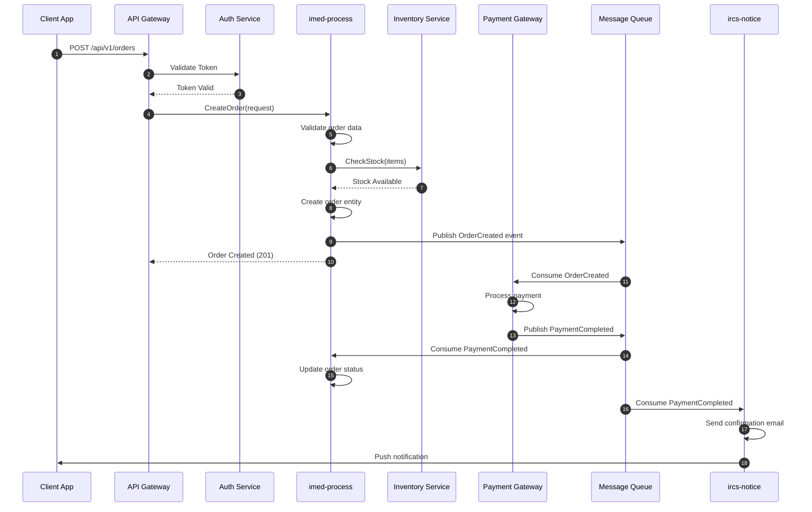
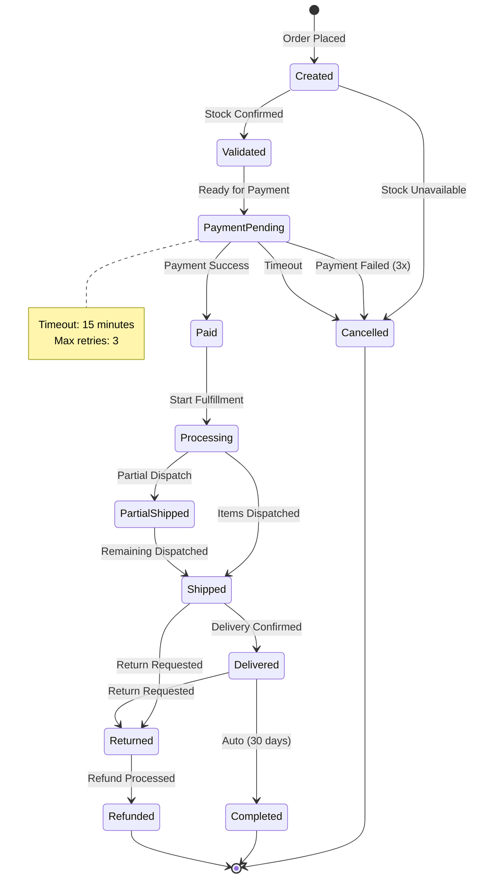
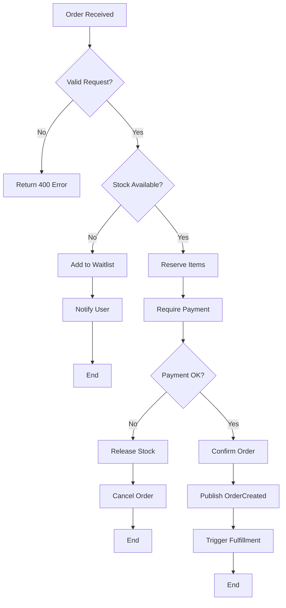
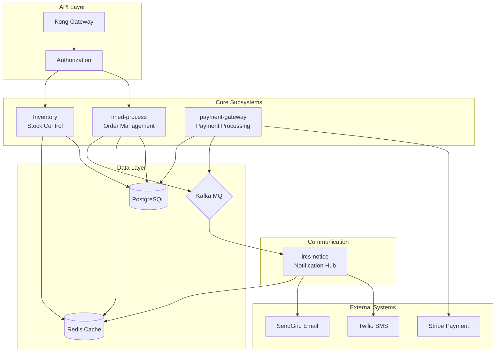
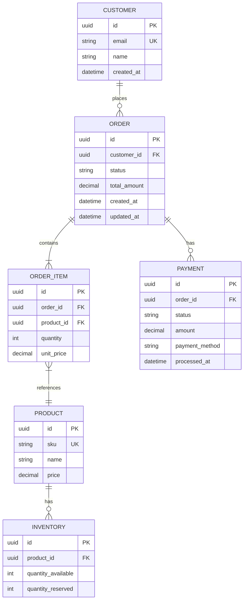

# Subsystem Context Generation - Step 3

## Context

This is **Step 3** of the Porto workflow. It analyzes knowledge base code repositories to generate comprehensive system context interaction diagrams for each identified subsystem.

**Input**: `step1_understanding.md`, `step2_subsystems.md`
**Output**: `step3_context.md`

## Purpose

As a **System Architect**, this step:

1. **Searches** knowledge base code repositories for each identified subsystem
2. **Analyzes** actual code patterns, API calls, and event handlers
3. **Generates** visual interaction diagrams using Mermaid syntax
4. **Documents** state machines for complex business flows
5. **Maps** data flow across subsystems

## Instructions

### 1. Check Knowledge Base

**First, check if any knowledge base with `repos_path` is configured and contains code:**

Read `~/.porto/config.json` and for each enabled knowledge base that has a `repos_path`:

```bash
# Check if knowledge base repos directory exists and is not empty
if [ -d {kb_repos_path} ] && [ "$(ls -A {kb_repos_path} 2>/dev/null)" ]; then
    echo "Knowledge base repos available: {kb_name}"
else
    echo "No repos found in knowledge base: {kb_name}"
fi
```

**If no knowledge base has code repositories:**
1. Generate a simplified `step3_context.md` indicating no code reference available
2. Skip detailed interaction diagrams (cannot infer from existing code)
3. Proceed to completion so user can continue to Step 4

### 2. Load Prerequisites

Read the following files:
- `step1_understanding.md` - Business requirements and flows
- `step2_subsystems.md` - Identified subsystems and their types

### 3. For Each Subsystem, Search Knowledge Base Repositories

**Skip this section if no knowledge base has code repositories.**

```bash
# For each subsystem identified in Step 2
for subsystem in {subsystem_names}; do
    # Search for the subsystem in knowledge base repos
    ls {kb_repos_path}/ | grep -i "$subsystem"
done
```

If a subsystem exists in knowledge base repos:
1. Read its structure and key files
2. Extract API endpoints and handlers
3. Identify event publishers and consumers
4. Find state management patterns

If not found:
1. Use the subsystem definition from Step 2
2. Infer interaction patterns from business requirements

### 3. Generate Interaction Diagrams

#### 3.1 Sequence Diagrams (Primary)

For each key business flow, generate a sequence diagram:



#### 3.2 State Diagrams (For Stateful Entities)

For entities with state transitions:



#### 3.3 Flowcharts (For Decision Logic)



#### 3.4 Component Diagrams (System Architecture)



#### 3.5 Entity Relationship Diagrams



### 4. Generate step3_context.md

#### 4.1 If Knowledge Base is Empty

If no code repositories are available in the knowledge base, generate this simplified document:

```markdown
# Step 3: Subsystem Context & Interactions

> 📋 Workflow ID: {WORKFLOW_ID}
> 📅 Generated: {TIMESTAMP}
> 📄 Based on: step2_subsystems.md

---

## ⚠️ No Code Reference Available

The knowledge base does not contain any code repositories. This step requires existing code to analyze for:
- API patterns and endpoints
- Event publishing/consuming patterns
- State management implementations
- Data models and relationships

### What This Means

Without code reference, the context generation step is **skipped**. The subsystem specifications in Step 4 will be generated based on:
1. Business requirements from Step 1
2. Subsystem definitions from Step 2
3. General best practices (no project-specific patterns)

### Identified Subsystems

| Subsystem | Type | Description |
|-----------|------|-------------|
| {List subsystems from step2} | ... | ... |

### Recommendation

To enable full context generation, add code repositories to a knowledge base configured in `~/.porto/config.json`.

---

## Next Steps

1. **Continue to Step 4**: Run `/porto.continue` to generate subsystem specifications
2. **Or add code reference**: Add code repositories to a knowledge base configured in `~/.porto/config.json`
```

**After generating this document, skip to the Workflow Integration section.**

#### 4.2 If Knowledge Base Has Code

Create `step3_context.md` with the following structure:

```markdown
# Step 3: Subsystem Context & Interactions

> 📋 Workflow ID: {WORKFLOW_ID}
> 📅 Generated: {TIMESTAMP}
> 📄 Based on: step2_subsystems.md

---

## 1. System Architecture Overview

### 1.1 High-Level Architecture

{Component diagram showing all subsystems}

### 1.2 Technology Stack per Subsystem

| Subsystem | Language | Framework | Database | Message Queue |
|-----------|----------|-----------|----------|---------------|
| ... | ... | ... | ... | ... |

---

## 2. Subsystem Interactions

### 2.1 Interaction Matrix

| From ↓ / To → | {sub1} | {sub2} | {sub3} | {sub4} |
|---------------|--------|--------|--------|--------|
| **{sub1}** | - | Sync | Async | - |
| **{sub2}** | Async | - | Sync | Async |
| **{sub3}** | - | - | - | Sync |
| **{sub4}** | Sync | Async | - | - |

### 2.2 Communication Patterns

| Pattern | Usage | Example |
|---------|-------|---------|
| Sync REST | Real-time queries | GetOrder, CheckStock |
| Async Events | Eventual consistency | OrderCreated, PaymentCompleted |
| gRPC | Internal high-perf | InventoryReserve |
| WebSocket | Real-time push | OrderStatusUpdate |

---

## 3. Business Flow Sequences

<!-- For each key business flow -->

### 3.1 {Flow Name}: {Description}

{Sequence diagram}

**Participants**:
- {Participant 1}: {Role}
- {Participant 2}: {Role}

**Key Interactions**:
1. {Step 1 description}
2. {Step 2 description}

**Error Handling**:
- {Error scenario 1}: {Handling}
- {Error scenario 2}: {Handling}

---

## 4. State Machines

<!-- For each stateful entity -->

### 4.1 {Entity Name} State Machine

{State diagram}

**States**:
| State | Description | Entry Actions | Exit Actions |
|-------|-------------|---------------|--------------|
| ... | ... | ... | ... |

**Transitions**:
| From | To | Trigger | Guard Condition |
|------|-----|---------|-----------------|
| ... | ... | ... | ... |

---

## 5. Decision Flows

<!-- For complex business logic -->

### 5.1 {Decision Flow Name}

{Flowchart}

**Decision Points**:
| Decision | Criteria | Outcomes |
|----------|----------|----------|
| ... | ... | ... |

---

## 6. Data Model

### 6.1 Entity Relationships

{ER Diagram}

### 6.2 Data Ownership

| Entity | Owner Subsystem | Replicated To | Sync Strategy |
|--------|-----------------|---------------|---------------|
| ... | ... | ... | ... |

---

## 7. Event Catalog

### 7.1 Published Events

| Subsystem | Event | Payload | Consumers |
|-----------|-------|---------|-----------|
| imed-process | OrderCreated | {orderId, items, customerId} | payment, inventory, notify |
| payment-gateway | PaymentCompleted | {paymentId, orderId, amount} | order, notify |

### 7.2 Consumed Events

| Subsystem | Event | Source | Action |
|-----------|-------|--------|--------|
| ircs-notice | OrderCreated | imed-process | Send order confirmation |
| inventory | OrderCreated | imed-process | Reserve stock |

---

## 8. Integration Contracts

### 8.1 Synchronous APIs

| Subsystem | Endpoint | Method | Request | Response |
|-----------|----------|--------|---------|----------|
| ... | ... | ... | ... | ... |

### 8.2 Asynchronous Events

| Event | Schema | Version | Topic |
|-------|--------|---------|-------|
| ... | ... | ... | ... |

---

## 9. Knowledge Base Repository References

### 9.1 Analyzed Repositories

| Subsystem | KB Path | Files Analyzed | Patterns Found |
|-----------|---------|----------------|----------------|
| imed-process | {kb_repos_path}/imed-process | 45 | Event sourcing, CQRS |
| ircs-notice | {kb_repos_path}/ircs-notice | 32 | Template engine, Multi-channel |

### 9.2 Code References

<!-- Key code snippets from knowledge base repos -->

---

## 10. Next Steps

After reviewing this document:

1. **Edit if needed**: `~/.porto/workflows/{WORKFLOW_ID}/step3_context.md`
2. **Continue to Step 4**: Run `/porto.continue` to generate subsystem specifications
3. **Refine interactions**: Adjust sequence flows or state machines
```

## Workflow Integration

After generating the context document:

1. **Update workflow.json**:
   ```json
   {
     "current_step": 3,
     "step3_status": "completed",
     "step3_output": "step3_context.md"
   }
   ```

2. **Display summary to user**:

   **If knowledge base was empty:**
   ```
   ⚠️ Step 3 Complete: Subsystem Context Generation (No Code Reference)

   📄 Output: ~/.porto/workflows/{WORKFLOW_ID}/step3_context.md

   Status: No code repositories found in knowledge base. Context generation was skipped.

   Next Actions:
   - Continue to Step 4: /porto.continue
   - Or add code repositories to a knowledge base in ~/.porto/config.json
   ```

   **If knowledge base had code:**
   ```
   ✅ Step 3 Complete: Subsystem Context Generation

   📄 Output: ~/.porto/workflows/{WORKFLOW_ID}/step3_context.md

   Generated Diagrams:
   - {N} Sequence diagrams
   - {N} State machines
   - {N} Flowcharts
   - {N} Component diagrams
   - {N} ER diagrams

   Knowledge Base Repositories Analyzed:
   - imed-process (45 files)
   - ircs-notice (32 files)

   Next Actions:
   - Review diagrams: cat ~/.porto/workflows/{WORKFLOW_ID}/step3_context.md
   - Edit interactions if needed
   - Continue to Step 4: /porto.continue
   ```

## Knowledge Base Repository Search Strategy

### Search Patterns

```bash
# Find API handlers
grep -r "func.*Handler\|@Route\|router\." {kb_repos_path}/{subsystem}/

# Find event publishers
grep -r "Publish\|Emit\|produce\|send.*event" {kb_repos_path}/{subsystem}/

# Find event consumers
grep -r "Subscribe\|Consume\|@Listener\|on.*event" {kb_repos_path}/{subsystem}/

# Find state transitions
grep -r "state\|status.*update\|transition" {kb_repos_path}/{subsystem}/

# Find database models
find {kb_repos_path}/{subsystem} -name "*model*" -o -name "*entity*" -o -name "*schema*"
```

### Code Analysis Checklist

For each subsystem found in the knowledge base:

- [ ] API routes and handlers
- [ ] Request/response schemas
- [ ] Event publishers and topics
- [ ] Event consumers and handlers
- [ ] Database models and relationships
- [ ] State management logic
- [ ] External service integrations
- [ ] Error handling patterns
