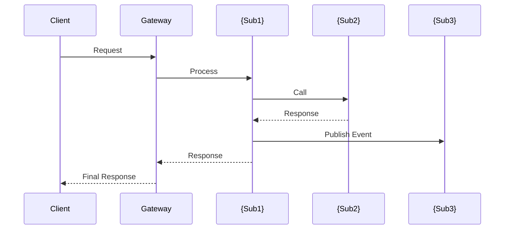

# Subsystem Identification - Step 2

## Context

This is **Step 2** of the Porto workflow. It identifies subsystems based on:
1. The business understanding from Step 1
2. Knowledge base references (from configured knowledge bases)

**Input**: `step1_understanding.md`
**Output**: `step2_subsystems.md`

## Instructions

### 1. Load Prerequisites

1. Read `step1_understanding.md` from the workflow directory
2. Invoke `knowledge-retrieval` skill to check existing systems
3. Identify which subsystem hints match existing systems vs. need new creation

### 2. Apply Decomposition Principles

Use Domain-Driven Design (DDD) principles:

| Principle | Description |
|-----------|-------------|
| **Bounded Context** | Each subsystem has clear boundaries |
| **Business Capability** | Organize by what business does, not technical layers |
| **High Cohesion** | Related functionality stays together |
| **Low Coupling** | Minimize dependencies between subsystems |
| **Data Ownership** | Each subsystem owns its data |

### 3. Identify Subsystems

For each identified subsystem, define:

| Attribute | Description |
|-----------|-------------|
| **Name** | Business-meaningful name (e.g., `imed-process`, `ircs-notice`) |
| **Type** | `existing` (reuse) / `extend` (modify existing) / `new` (create) |
| **Responsibility** | Single-sentence description of what it does |
| **Core Capabilities** | List of business capabilities |
| **Data Owned** | Entities this subsystem owns |
| **Dependencies** | Other subsystems it depends on |
| **Knowledge Base Reference** | Link to similar existing system (if any) |

### 4. Map Subsystem Interactions

Create interaction diagrams showing:
- Synchronous calls (REST/gRPC)
- Asynchronous events (Message Queue)
- Shared data (if any)

### 5. Generate Subsystem Overview

Create `step2_subsystems.md` with the following structure:

```markdown
# Step 2: Subsystem Identification

> 📋 Workflow ID: {WORKFLOW_ID}
> 📅 Generated: {TIMESTAMP}
> 📄 Based on: step1_understanding.md

---

## 1. Overview

### 1.1 Decomposition Summary

| Metric | Value |
|--------|-------|
| Total Subsystems | {N} |
| New Subsystems | {N} |
| Extending Existing | {N} |
| Reusing Existing | {N} |

### 1.2 System Architecture Diagram

```mermaid
graph TB
    subgraph Clients["Client Applications"]
        WEB[Web App]
        MOBILE[Mobile App]
    end

    subgraph Gateway["API Gateway"]
        GW[Gateway]
    end

    subgraph Services["Subsystems"]
        {Subsystem nodes}
    end

    subgraph Data["Data Layer"]
        {Database nodes}
    end

    {Connection relationships}
```

---

## 2. Subsystem Definitions

<!-- FOR each subsystem -->

### 2.{N} {subsystem_name}

| Attribute | Value |
|-----------|-------|
| **Type** | {new/extend/existing} |
| **Responsibility** | {Single sentence} |
| **Knowledge Base Ref** | {Link or "None"} |

#### Business Capabilities

| Capability | Description | Priority |
|------------|-------------|----------|
| ... | ... | P0/P1/P2 |

#### Data Ownership

| Entity | Operations | Storage |
|--------|------------|---------|
| ... | CRUD | Database type |

#### Dependencies

| Depends On | Type | Purpose |
|------------|------|---------|
| ... | sync/async | ... |

#### Exposed APIs (Preliminary)

| Method | Endpoint | Description |
|--------|----------|-------------|
| ... | ... | ... |

#### Events (Preliminary)

| Event | Direction | Trigger |
|-------|-----------|---------|
| ... | Publish/Consume | ... |

<!-- END FOR -->

---

## 3. Subsystem Interaction Matrix

| From ↓ / To → | {sub1} | {sub2} | {sub3} |
|---------------|--------|--------|--------|
| **{sub1}** | - | sync | async |
| **{sub2}** | async | - | sync |
| **{sub3}** | - | - | - |

---

## 4. Interaction Sequence Diagrams

### 4.1 {Key Business Flow Name}



---

## 5. Knowledge Base References

### 5.1 Matched Systems

| Subsystem | Matched KB System | Match Type | Reuse Strategy |
|-----------|------------------|------------|----------------|
| ... | ... | exact/similar | Reference architecture |

### 5.2 Reference Details

<!-- FOR each matched system -->

#### {kb_system_name}

**Location**: `{kb_path}/{kb_system_name}/`

**Applicable Patterns**:
- {Pattern 1}
- {Pattern 2}

**APIs to Reference**:
- {API endpoint patterns}

**Data Models to Consider**:
- {Entity structures}

<!-- END FOR -->

---

## 6. Technology Stack Recommendations

### 6.1 Per-Subsystem Stack

| Subsystem | Language | Framework | Database | Message Queue |
|-----------|----------|-----------|----------|---------------|
| ... | ... | ... | ... | ... |

### 6.2 Shared Infrastructure

| Component | Technology | Purpose |
|-----------|------------|---------|
| API Gateway | Kong/Nginx | Request routing |
| Service Discovery | Consul/K8s | Service registration |
| Message Queue | Kafka/RabbitMQ | Async communication |
| Cache | Redis | Distributed caching |

---

## 7. Risk Assessment

| Risk | Impact | Mitigation |
|------|--------|------------|
| ... | High/Medium/Low | ... |

---

## 8. Next Steps

After reviewing this document:

1. **Edit if needed**: `~/.porto/workflows/{WORKFLOW_ID}/step2_subsystems.md`
2. **Continue to Step 3**: Run `/porto.continue` to generate detailed requirement specs
3. **Refine subsystems**: Adjust names, responsibilities, or boundaries

---

## Appendix: Decomposition Rationale

### Why These Boundaries?

{Explain the reasoning behind the chosen subsystem boundaries}

### Alternative Decompositions Considered

| Approach | Pros | Cons | Why Not Chosen |
|----------|------|------|----------------|
| ... | ... | ... | ... |
```

## Workflow Integration

After generating the report:

1. **Update workflow metadata**:
   ```json
   {
     "current_step": 2,
     "step2_status": "completed",
     "step2_output": "step2_subsystems.md",
     "identified_subsystems": ["imed-process", "ircs-notice", "..."]
   }
   ```

2. **Display summary to user**:
   ```
   ✅ Step 2 Complete: Subsystem Identification

   📄 Output: ~/.porto/workflows/{WORKFLOW_ID}/step2_subsystems.md

   Summary:
   - {N} subsystems identified
   - {N} new, {N} extending existing, {N} reusing
   - {N} knowledge base references found

   Identified Subsystems:
   1. imed-process (new) - Order processing
   2. ircs-notice (extend) - Notification handling
   3. ...

   Next Actions:
   - Review the document: cat ~/.porto/workflows/{WORKFLOW_ID}/step2_subsystems.md
   - Edit subsystem names or boundaries if needed
   - Continue to Step 3: /porto.continue
   ```

## Knowledge Base Integration

The skill should:

1. **Exact Match First**: Check if PRD mentions existing system names
2. **Similarity Search**: Match business domains to existing systems
3. **Reference Extraction**: Pull architecture patterns from matched systems
4. **Gap Identification**: Identify capabilities not covered by existing systems
