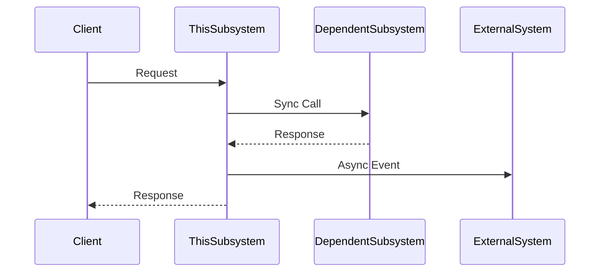

# Subsystem Specification Generation - Step 3

## Context

This is **Step 3** of the Porto workflow. It generates detailed requirement specifications for each subsystem identified in Step 2.

**Input**: `step1_understanding.md`, `step2_subsystems.md`
**Output**: `step3/{subsystem_name}/REQUIREMENTS.md` for each subsystem

## Purpose

For each identified subsystem, generate a comprehensive requirements document that:
1. **Defines** business capabilities to implement
2. **Specifies** API contracts
3. **Details** data model requirements
4. **Identifies** integration requirements
5. **References** existing patterns from configured knowledge bases (if available)

## Instructions

### 1. Load Prerequisites

Read the following files:
- `step1_understanding.md` - Business requirements and features
- `step2_subsystems.md` - Subsystem definitions and boundaries

### 2. Check Knowledge Base

Read the knowledge base configuration from `~/.porto/config.json` and search for matching systems.

For each subsystem, check if a similar system exists in the knowledge base for reference patterns.

### 3. Generate Specifications Per Subsystem

For each subsystem defined in Step 2, create a dedicated directory and REQUIREMENTS.md:

```
step3/
├── {subsystem_1}/
│   └── REQUIREMENTS.md
├── {subsystem_2}/
│   └── REQUIREMENTS.md
└── {subsystem_n}/
    └── REQUIREMENTS.md
```

### 4. REQUIREMENTS.md Template

```markdown
# {subsystem_name} - System Requirements

> 📋 Workflow ID: {WORKFLOW_ID}
> 📅 Generated: {TIMESTAMP}
> 📄 Source: step2_subsystems.md
> 🔗 Knowledge Base: {Link to matched KB system if found, or "None"}

---

## 1. Executive Summary

### 1.1 Subsystem Overview

| Attribute | Value |
|-----------|-------|
| **Name** | {subsystem_name} |
| **Type** | new / extend / existing |
| **Responsibility** | {Single sentence from Step 2} |
| **Owner** | {Suggested team} |

### 1.2 Business Context

{2-3 sentences explaining why this subsystem exists and its role in the overall system}

---

## 2. Business Capabilities

### 2.1 Required Capabilities

| ID | Capability | Description | Priority | Source (PRD Section) |
|----|------------|-------------|----------|---------------------|
| BC-001 | {name} | {what it does} | P0/P1/P2 | {reference} |

### 2.2 Capability Details

<!-- FOR each capability -->

#### BC-{N}: {Capability Name}

**Description**: {Detailed description}

**Acceptance Criteria**:
- [ ] {Criterion 1}
- [ ] {Criterion 2}
- [ ] {Criterion 3}

**Business Rules**:
| Rule | Description |
|------|-------------|
| BR-{N} | {Rule description} |

<!-- END FOR -->

---

## 3. API Requirements

### 3.1 API Overview

| Method | Endpoint | Description | Priority |
|--------|----------|-------------|----------|
| GET | /api/v1/{resource} | {description} | P0 |
| POST | /api/v1/{resource} | {description} | P0 |
| PUT | /api/v1/{resource}/{id} | {description} | P1 |
| DELETE | /api/v1/{resource}/{id} | {description} | P1 |

### 3.2 API Specifications

<!-- FOR each API endpoint -->

#### {METHOD} {Endpoint}

**Purpose**: {What this API does}

**Request**:
```json
{
  "field1": "string",
  "field2": "number",
  "field3": {
    "nested": "object"
  }
}
```

**Response**:
```json
{
  "code": 0,
  "data": {
    "id": "string",
    "result": "object"
  },
  "message": "string"
}
```

**Error Codes**:
| Code | Description |
|------|-------------|
| 400 | Invalid request parameters |
| 401 | Unauthorized |
| 404 | Resource not found |

**Business Rules**:
- {Rule 1}
- {Rule 2}

<!-- END FOR -->

---

## 4. Data Model Requirements

### 4.1 Entities

| Entity | Description | Owner |
|--------|-------------|-------|
| {Entity1} | {description} | This subsystem |
| {Entity2} | {description} | External (reference only) |

### 4.2 Entity Definitions

<!-- FOR each entity owned by this subsystem -->

#### {Entity Name}

**Description**: {What this entity represents}

**Attributes**:
| Attribute | Type | Required | Description | Constraints |
|-----------|------|----------|-------------|-------------|
| id | string | Yes | Unique identifier | UUID format |
| name | string | Yes | Display name | Max 100 chars |
| createdAt | datetime | Yes | Creation timestamp | Auto-generated |
| updatedAt | datetime | Yes | Last update timestamp | Auto-updated |

**Relationships**:
| Relationship | Target Entity | Type | Description |
|--------------|---------------|------|-------------|
| belongsTo | {Entity} | Many-to-One | {description} |
| hasMany | {Entity} | One-to-Many | {description} |

**Indexes**:
| Index | Fields | Type | Purpose |
|-------|--------|------|---------|
| idx_{name} | {field1, field2} | Unique/Non-unique | {purpose} |

<!-- END FOR -->

### 4.3 Entity Relationship Diagram

```mermaid
erDiagram
    {ENTITY_A} ||--o{ {ENTITY_B} : "contains"
    {ENTITY_A} ||--|| {ENTITY_C} : "belongs to"
```

---

## 5. Integration Requirements

### 5.1 Dependencies

| System | Type | Purpose | Integration Method |
|--------|------|---------|-------------------|
| {subsystem} | Internal | {purpose} | REST / gRPC / MQ |
| {external} | External | {purpose} | REST / Webhook |

### 5.2 Events

#### Published Events

| Event Name | Trigger | Payload Summary | Consumers |
|------------|---------|-----------------|-----------|
| {event.name} | {when} | {fields} | {subsystems} |

#### Consumed Events

| Event Name | Source | Purpose | Action |
|------------|--------|---------|--------|
| {event.name} | {subsystem} | {purpose} | {what to do} |

### 5.3 Integration Sequence



---

## 6. Non-Functional Requirements

### 6.1 Performance

| Metric | Requirement | Priority |
|--------|-------------|----------|
| Response Time | < 200ms (P95) | P0 |
| Throughput | 1000 req/sec | P1 |
| Concurrent Users | 10,000 | P1 |

### 6.2 Reliability

| Metric | Requirement | Priority |
|--------|-------------|----------|
| Availability | 99.9% | P0 |
| Data Durability | 99.999% | P0 |
| Recovery Time (RTO) | < 5 minutes | P1 |
| Recovery Point (RPO) | < 1 minute | P1 |

### 6.3 Security

| Requirement | Description | Priority |
|-------------|-------------|----------|
| Authentication | JWT / OAuth2 | P0 |
| Authorization | RBAC | P0 |
| Data Encryption | AES-256 at rest, TLS 1.3 in transit | P0 |
| Audit Logging | All data modifications | P1 |

### 6.4 Scalability

| Requirement | Description | Priority |
|-------------|-------------|----------|
| Horizontal Scaling | Support pod auto-scaling | P1 |
| Database Sharding | Support data partitioning | P2 |

---

## 7. Technology Recommendations

### 7.1 Recommended Stack

| Category | Technology | Rationale |
|----------|------------|-----------|
| Language | {Go/Java/TypeScript} | {why} |
| Framework | {Gin/Spring/Fastify} | {why} |
| Database | {PostgreSQL/MySQL/MongoDB} | {why} |
| Cache | {Redis} | {why} |
| Message Queue | {Kafka/RabbitMQ} | {why} |

### 7.2 Reference from Knowledge Base

<!-- If matched to existing system in knowledge base -->

**Matched System**: `{kb_subsystem_name}`

| Aspect | Reference |
|--------|-----------|  
| Architecture | {kb_path}/{kb_subsystem}/ARCHITECTURE.md |
| API Patterns | {kb_path}/{kb_subsystem}/SUMMARY.md#api-overview |
| Data Models | {kb_path}/{kb_subsystem}/SUMMARY.md#data-models |
| File Structure | {kb_path}/{kb_subsystem}/FILE_INDEX.md |

**Patterns to Reuse**:
- {Pattern 1}
- {Pattern 2}

---

## 8. Constraints & Assumptions

### 8.1 Constraints

- {Technical constraint 1}
- {Business constraint 2}

### 8.2 Assumptions

- {Assumption 1}
- {Assumption 2}

---

## 9. Open Questions

| ID | Question | Impact | Owner |
|----|----------|--------|-------|
| Q-001 | {question} | {impact on design} | {who to ask} |

---

## 10. Acceptance Checklist

Before marking this subsystem as ready for development:

- [ ] All P0 capabilities have detailed specifications
- [ ] All P0 APIs are documented with request/response schemas
- [ ] Data models are complete with relationships
- [ ] Integration points are identified
- [ ] Non-functional requirements are quantified
- [ ] Open questions are resolved

---

## Appendix: Change Log

| Date | Version | Changes | Author |
|------|---------|---------|--------|
| {date} | 1.0 | Initial generation | Porto |
```

## Workflow Integration

After generating all specifications:

1. **Update workflow.json**:
   ```json
   {
     "current_step": 3,
     "step3_status": "completed",
     "step3_output": "step3/",
     "subsystem_specs": [
       "step3/imed-process/REQUIREMENTS.md",
       "step3/ircs-notice/REQUIREMENTS.md"
     ]
   }
   ```

2. **Display completion summary**:
   ```
   ✅ Step 3 Complete: Subsystem Specification Generation

   📂 Output Directory: ~/.porto/workflows/{WORKFLOW_ID}/step3/

   Generated Specifications:
   ├── imed-process/REQUIREMENTS.md
   │   └── 5 capabilities, 12 APIs, 3 entities
   ├── ircs-notice/REQUIREMENTS.md
   │   └── 3 capabilities, 8 APIs, 2 entities
   └── payment-gateway/REQUIREMENTS.md
       └── 4 capabilities, 10 APIs, 4 entities

   🎉 Workflow Complete!

   Next Actions:
   • Review specifications: ls ~/.porto/workflows/{WORKFLOW_ID}/step3/
   • Start development planning for each subsystem
   • Assign specifications to development teams
   ```

## Knowledge Base Usage

When generating specifications, reference the configured knowledge bases for:

| Scenario | Action |
|----------|--------|
| **Exact match found** | Use existing patterns, adapt to new requirements |
| **Similar system found** | Reference architecture, modify for differences |
| **No match** | Generate from scratch using DDD principles |

### Extracting from Knowledge Base Documents

**From README.md**:
- Technology stack recommendations
- Core module patterns

**From SUMMARY.md**:
- API naming conventions
- Data model patterns
- Feature organization

**From ARCHITECTURE.md**:
- Layer structure
- Design patterns
- Integration patterns

**From FILE_INDEX.md**:
- File organization patterns
- Naming conventions
