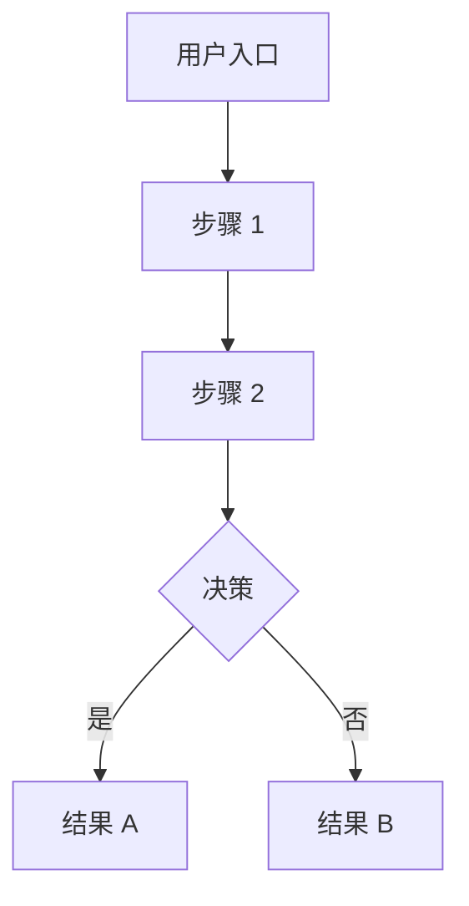
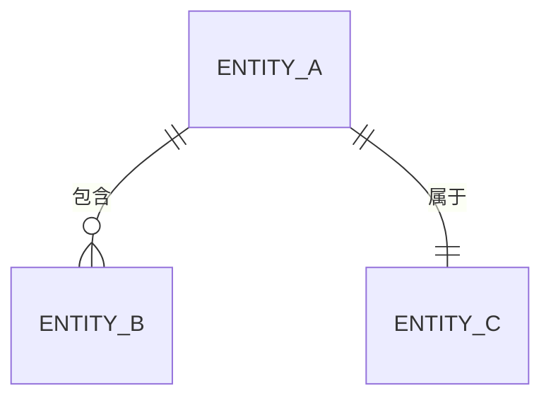

# PRD 分解 - Step 1: 业务理解

## 背景

这是 Porto 工作流的 **Step 1**。它读取并分析 PRD 文档，生成全面的理解报告。

**输入**: PRD 文档路径
**输出**: 工作流目录中的 `step1_understanding.md`

## 指令

### 1. 读取 PRD 文档

从 `<WORKFLOW_DIR>/inputs/` 目录读取所有提供的 PRD 文件。

### 2. 提取核心信息

分析文档并提取：

| 类别 | 提取内容 |
|------|---------|
| **项目背景** | 为什么要构建这个？业务背景 |
| **业务目标** | 项目要实现什么目标？ |
| **目标用户** | 谁将使用这个系统？ |
| **核心业务流程** | 用户如何与系统交互？ |
| **功能列表** | 功能需求的详细分解 |
| **非功能性需求** | 性能、安全、可扩展性需求 |
| **数据实体** | 核心业务对象及其关系 |
| **集成需求** | 需要集成的外部系统 |
| **约束条件** | 技术或业务约束 |

### 3. 识别子系统线索

在分析时，也要识别关于潜在子系统的线索：

- 提及的业务领域（如"用户管理"、"订单处理"）
- 现有系统引用（如"与 imed-process 集成"）
- 组织边界（如"支付团队"、"通知团队"）

### 4. 生成理解报告

创建具有以下结构的 `step1_understanding.md`：

```markdown
# Step 1: 业务需求理解

> 📋 工作流 ID: {WORKFLOW_ID}
> 📅 生成时间: {TIMESTAMP}
> 📄 源文档: {输入文件列表}

---

## 1. 执行摘要

### 1.1 项目概述
{2-3 句话描述项目内容}

### 1.2 业务目标
| 目标 | 优先级 | 成功指标 |
|------|--------|----------|
| ... | P0/P1/P2 | ... |

### 1.3 目标用户
{主要和次要用户群体的描述}

---

## 2. 业务流程分析

### 2.1 主要用户旅程



### 2.2 备选流程
{边缘情况和替代路径}

### 2.3 业务规则
| 规则 ID | 描述 | 适用范围 |
|---------|------|----------|
| BR-001 | ... | ... |

---

## 3. 功能分解

### 3.1 必须有功能 (P0)
| ID | 功能 | 描述 | 验收标准 |
|----|------|------|----------|
| F-001 | ... | ... | ... |

### 3.2 应该有功能 (P1)
{表格格式}

### 3.3 可以有功能 (P2)
{如适用，表格格式}

---

## 4. 领域模型草图

### 4.1 核心实体

| 实体 | 描述 | 关键属性 |
|------|------|----------|
| ... | ... | ... |

### 4.2 实体关系



### 4.3 数据流概述
{高层级数据流描述}

---

## 5. 非功能性需求

| 类别 | 需求 | 指标/目标 | 优先级 |
|------|------|-----------|--------|
| 性能 | 响应时间 | < 200ms | P0 |
| 可扩展性 | 并发用户 | 10,000 | P1 |
| 安全性 | 数据加密 | AES-256 | P0 |
| 可用性 | 正常运行时间 | 99.9% | P0 |

---

## 6. 集成需求

### 6.1 外部系统
| 系统 | 用途 | 集成类型 | 优先级 |
|------|------|----------|--------|
| ... | ... | REST/MQ/Webhook | ... |

### 6.2 数据交换
{数据交换需求描述}

---

## 7. 子系统线索

> 💡 这些是 Step 2 的初步线索。在子系统识别阶段审查和完善。

| 线索 | 来源 | 建议名称 | 备注 |
|------|------|----------|------|
| 用户管理 | PRD 第 3.1 节 | user-service | 认证、用户资料 |
| 订单处理 | PRD 第 4.2 节 | order-service | 核心业务逻辑 |
| ... | ... | ... | ... |

---

## 8. 约束与假设

### 8.1 技术约束
- {列出技术约束}

### 8.2 业务约束
- {列出业务约束}

### 8.3 假设
- {分析过程中所做的假设}

---

## 9. 问题与澄清

> ⚠️ 需要相关方输入的项目，在继续之前需要解决

| ID | 问题 | 影响 | 询问对象 |
|----|------|------|----------|
| Q-001 | ... | 阻塞子系统设计 | 产品负责人 |

---

## 下一步

审查此文档后：

1. **如需编辑**: `~/.porto/workflows/{WORKFLOW_ID}/step1_understanding.md`
2. **继续到 Step 2**: 运行 `/porto.continue` 识别子系统
3. **提出问题**: 在继续之前解决第 9 节中的问题
```

## 工作流集成

生成报告后：

1. **更新工作流元数据**:
   ```json
   {
     "current_step": 1,
     "step1_status": "completed",
     "step1_output": "step1_understanding.md"
   }
   ```

2. **向用户显示摘要**:
   ```
   ✅ Step 1 完成: 业务需求理解

   📄 输出: ~/.porto/workflows/{WORKFLOW_ID}/step1_understanding.md

   摘要:
   - 识别 {N} 个功能 (P0: {n}, P1: {n}, P2: {n})
   - 检测到 {N} 个子系统线索
   - 提出 {N} 个待澄清问题

   下一步操作:
   - 查看文档: cat ~/.porto/workflows/{WORKFLOW_ID}/step1_understanding.md
   - 如需编辑，然后运行: /porto.continue
   - 或直接继续: /porto.continue
   ```

## 示例

**输入**: 电商平台 PRD

**输出要点**:
- 执行摘要: 面向本地商户的 B2C 市场
- 5 个 P0 功能: 商品目录、购物车、结账、支付、订单追踪
- 3 个 P1 功能: 评价、心愿单、积分
- 领域实体: 用户、商品、订单、支付、商户
- 子系统线索: catalog-service, cart-service, order-service, payment-service
- 集成: 支付网关 (Stripe)、短信服务商 (Twilio)
