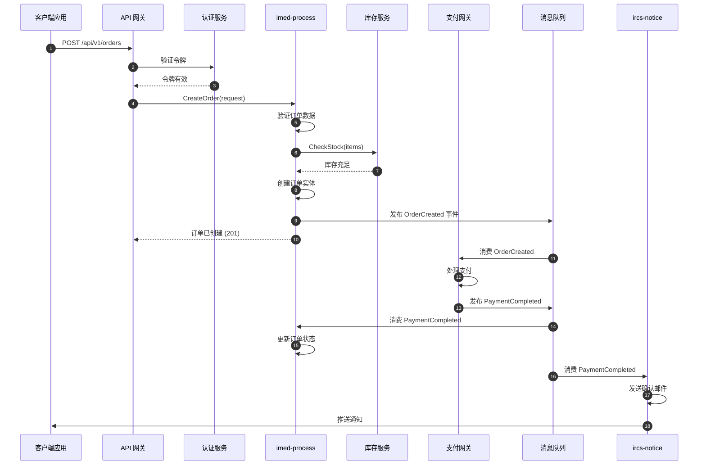
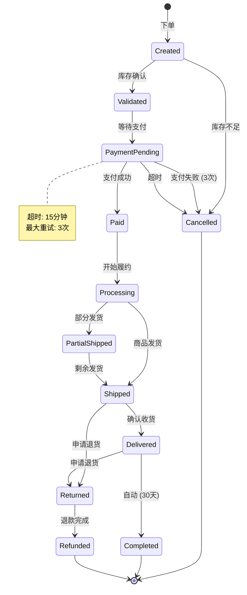
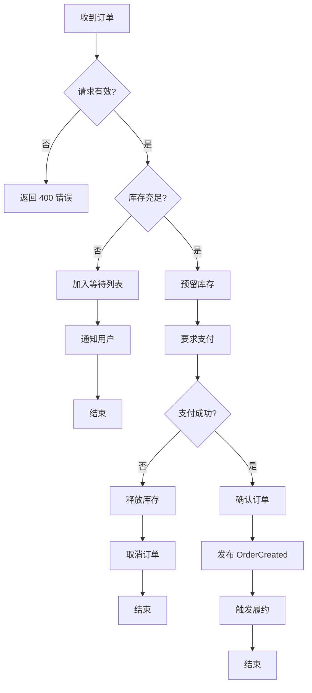
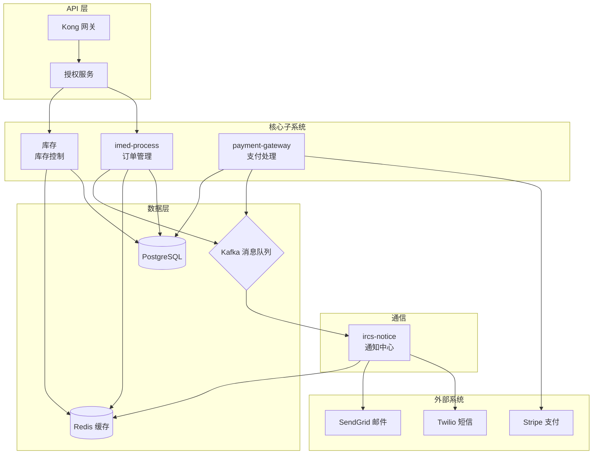
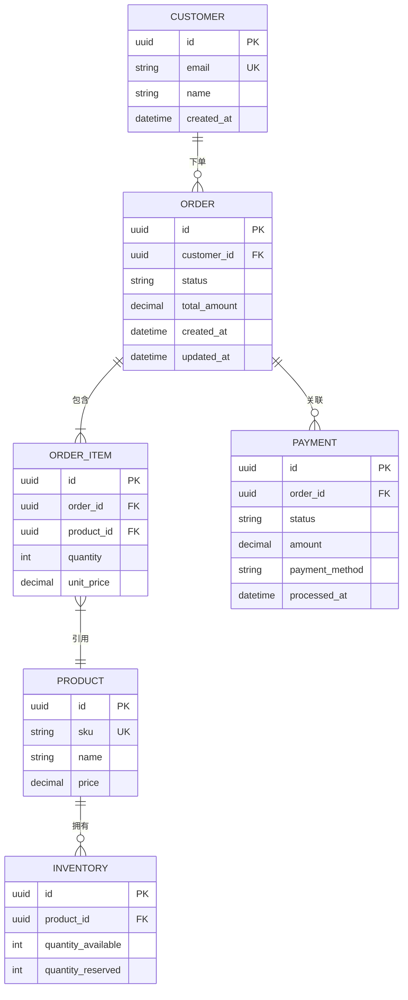

# 子系统上下文生成 - Step 3

## 背景

这是 Porto 工作流的 **Step 3**。它分析知识库代码仓库，为每个识别的子系统生成全面的系统上下文交互图。

**输入**: `step1_understanding.md`, `step2_subsystems.md`
**输出**: `step3_context.md`

## 目的

作为**系统架构师**，此步骤：

1. **搜索** 知识库代码仓库中每个识别的子系统
2. **分析** 实际代码模式、API 调用和事件处理器
3. **生成** 使用 Mermaid 语法的可视化交互图
4. **文档化** 复杂业务流程的状态机
5. **映射** 跨子系统的数据流

## 指令

### 1. 检查知识库

**首先，检查是否有配置了 `repos_path` 的知识库且包含代码：**

读取 `~/.porto/config.json`，对每个启用的且有 `repos_path` 的知识库：

```bash
# 检查知识库仓库目录是否存在且不为空
if [ -d {kb_repos_path} ] && [ "$(ls -A {kb_repos_path} 2>/dev/null)" ]; then
    echo "知识库仓库可用: {kb_name}"
else
    echo "知识库中未找到仓库: {kb_name}"
fi
```

**如果没有知识库包含代码仓库：**
1. 生成简化的 `step3_context.md`，说明没有代码参考
2. 跳过详细的交互图生成（无法从现有代码推断）
3. 继续完成步骤，让用户可以继续到 Step 4

### 2. 加载前置条件

读取以下文件：
- `step1_understanding.md` - 业务需求和流程
- `step2_subsystems.md` - 已识别的子系统及其类型

### 3. 对每个子系统，搜索知识库仓库

**如果没有知识库包含代码仓库，跳过此部分。**

```bash
# 对 Step 2 识别的每个子系统
for subsystem in {subsystem_names}; do
    # 在知识库仓库中搜索子系统
    ls {kb_repos_path}/ | grep -i "$subsystem"
done
```

如果子系统存在于知识库仓库：
1. 读取其结构和关键文件
2. 提取 API 端点和处理器
3. 识别事件发布者和消费者
4. 查找状态管理模式

如果未找到：
1. 使用 Step 2 中的子系统定义
2. 从业务需求推断交互模式

### 3. 生成交互图

#### 3.1 时序图（主要）

对每个关键业务流程，生成时序图：



#### 3.2 状态图（用于有状态实体）

对有状态转换的实体：



#### 3.3 流程图（用于决策逻辑）



#### 3.4 组件图（系统架构）



#### 3.5 实体关系图



### 4. 生成 step3_context.md

#### 4.1 如果知识库为空

如果知识库中没有代码仓库，生成以下简化文档：

```markdown
# Step 3: 子系统上下文与交互

> 📋 工作流 ID: {WORKFLOW_ID}
> 📅 生成时间: {TIMESTAMP}
> 📄 基于: step2_subsystems.md

---

## ⚠️ 无代码参考

知识库中没有代码仓库。此步骤需要分析现有代码来获取：
- API 模式和端点
- 事件发布/消费模式
- 状态管理实现
- 数据模型和关系

### 这意味着什么

没有代码参考，上下文生成步骤将被**跳过**。Step 4 的子系统规格将基于以下内容生成：
1. Step 1 的业务需求
2. Step 2 的子系统定义
3. 通用最佳实践（无项目特定模式）

### 已识别的子系统

| 子系统 | 类型 | 描述 |
|--------|------|------|
| {列出 step2 中的子系统} | ... | ... |

### 建议

要启用完整的上下文生成，请在 `~/.porto/config.json` 配置的知识库中添加代码仓库。

---

## 下一步

1. **继续到 Step 4**: 运行 `/porto.continue` 生成子系统规格
2. **或添加代码参考**: 在 `~/.porto/config.json` 配置的知识库中添加代码仓库
```

**生成此文档后，跳转到工作流集成部分。**

#### 4.2 如果知识库有代码

创建具有以下结构的 `step3_context.md`：

```markdown
# Step 3: 子系统上下文与交互

> 📋 工作流 ID: {WORKFLOW_ID}
> 📅 生成时间: {TIMESTAMP}
> 📄 基于: step2_subsystems.md

---

## 1. 系统架构概览

### 1.1 高层架构

{组件图展示所有子系统}

### 1.2 各子系统技术栈

| 子系统 | 语言 | 框架 | 数据库 | 消息队列 |
|--------|------|------|--------|----------|
| ... | ... | ... | ... | ... |

---

## 2. 子系统交互

### 2.1 交互矩阵

| 从 ↓ / 到 → | {sub1} | {sub2} | {sub3} | {sub4} |
|--------------|--------|--------|--------|--------|
| **{sub1}** | - | 同步 | 异步 | - |
| **{sub2}** | 异步 | - | 同步 | 异步 |
| **{sub3}** | - | - | - | 同步 |
| **{sub4}** | 同步 | 异步 | - | - |

### 2.2 通信模式

| 模式 | 用途 | 示例 |
|------|------|------|
| 同步 REST | 实时查询 | GetOrder, CheckStock |
| 异步事件 | 最终一致性 | OrderCreated, PaymentCompleted |
| gRPC | 内部高性能 | InventoryReserve |
| WebSocket | 实时推送 | OrderStatusUpdate |

---

## 3. 业务流程时序

<!-- 对每个关键业务流程 -->

### 3.1 {流程名称}: {描述}

{时序图}

**参与者**:
- {参与者 1}: {角色}
- {参与者 2}: {角色}

**关键交互**:
1. {步骤 1 描述}
2. {步骤 2 描述}

**错误处理**:
- {错误场景 1}: {处理方式}
- {错误场景 2}: {处理方式}

---

## 4. 状态机

<!-- 对每个有状态实体 -->

### 4.1 {实体名称} 状态机

{状态图}

**状态说明**:
| 状态 | 描述 | 入口动作 | 出口动作 |
|------|------|----------|----------|
| ... | ... | ... | ... |

**转换规则**:
| 从 | 到 | 触发条件 | 守卫条件 |
|------|-----|---------|----------|
| ... | ... | ... | ... |

---

## 5. 决策流程

<!-- 对复杂业务逻辑 -->

### 5.1 {决策流程名称}

{流程图}

**决策点**:
| 决策 | 判断标准 | 结果 |
|------|----------|------|
| ... | ... | ... |

---

## 6. 数据模型

### 6.1 实体关系

{ER 图}

### 6.2 数据所有权

| 实体 | 所属子系统 | 复制到 | 同步策略 |
|------|------------|--------|----------|
| ... | ... | ... | ... |

---

## 7. 事件目录

### 7.1 发布的事件

| 子系统 | 事件 | 载荷 | 消费者 |
|--------|------|------|--------|
| imed-process | OrderCreated | {orderId, items, customerId} | payment, inventory, notify |
| payment-gateway | PaymentCompleted | {paymentId, orderId, amount} | order, notify |

### 7.2 消费的事件

| 子系统 | 事件 | 来源 | 动作 |
|--------|------|------|------|
| ircs-notice | OrderCreated | imed-process | 发送订单确认 |
| inventory | OrderCreated | imed-process | 预留库存 |

---

## 8. 集成契约

### 8.1 同步 API

| 子系统 | 端点 | 方法 | 请求 | 响应 |
|--------|------|------|------|------|
| ... | ... | ... | ... | ... |

### 8.2 异步事件

| 事件 | 模式 | 版本 | 主题 |
|------|------|------|------|
| ... | ... | ... | ... |

---

## 9. 知识库仓库引用

### 9.1 已分析仓库

| 子系统 | 知识库路径 | 分析文件数 | 发现模式 |
|--------|----------|------------|----------|
| imed-process | {kb_repos_path}/imed-process | 45 | 事件溯源, CQRS |
| ircs-notice | {kb_repos_path}/ircs-notice | 32 | 模板引擎, 多渠道 |

### 9.2 代码引用

<!-- 来自知识库仓库的关键代码片段 -->

---

## 10. 下一步

审查此文档后：

1. **如需编辑**: `~/.porto/workflows/{WORKFLOW_ID}/step3_context.md`
2. **继续到 Step 4**: 运行 `/porto.continue` 生成子系统规格
3. **完善交互**: 调整时序流或状态机
```

## 工作流集成

生成上下文文档后：

1. **更新 workflow.json**:
   ```json
   {
     "current_step": 3,
     "step3_status": "completed",
     "step3_output": "step3_context.md"
   }
   ```

2. **向用户显示摘要**:

   **如果知识库为空：**
   ```
   ⚠️ Step 3 完成: 子系统上下文生成（无代码参考）

   📄 输出: ~/.porto/workflows/{WORKFLOW_ID}/step3_context.md

   状态: 知识库中未找到代码仓库。上下文生成已跳过。

   下一步操作:
   - 继续到 Step 4: /porto.continue
   - 或在 ~/.porto/config.json 中配置的知识库中添加代码仓库
   ```

   **如果知识库有代码：**
   ```
   ✅ Step 3 完成: 子系统上下文生成

   📄 输出: ~/.porto/workflows/{WORKFLOW_ID}/step3_context.md

   已生成图表:
   - {N} 个时序图
   - {N} 个状态机
   - {N} 个流程图
   - {N} 个组件图
   - {N} 个 ER 图

   已分析知识库仓库:
   - imed-process (45 个文件)
   - ircs-notice (32 个文件)

   下一步操作:
   - 查看图表: cat ~/.porto/workflows/{WORKFLOW_ID}/step3_context.md
   - 如需调整交互
   - 继续到 Step 4: /porto.continue
   ```

## 知识库仓库搜索策略

### 搜索模式

```bash
# 查找 API 处理器
grep -r "func.*Handler\|@Route\|router\." {kb_repos_path}/{subsystem}/

# 查找事件发布者
grep -r "Publish\|Emit\|produce\|send.*event" {kb_repos_path}/{subsystem}/

# 查找事件消费者
grep -r "Subscribe\|Consume\|@Listener\|on.*event" {kb_repos_path}/{subsystem}/

# 查找状态转换
grep -r "state\|status.*update\|transition" {kb_repos_path}/{subsystem}/

# 查找数据库模型
find {kb_repos_path}/{subsystem} -name "*model*" -o -name "*entity*" -o -name "*schema*"
```

### 代码分析检查清单

对知识库中找到的每个子系统：

- [ ] API 路由和处理器
- [ ] 请求/响应模式
- [ ] 事件发布者和主题
- [ ] 事件消费者和处理器
- [ ] 数据库模型和关系
- [ ] 状态管理逻辑
- [ ] 外部服务集成
- [ ] 错误处理模式
