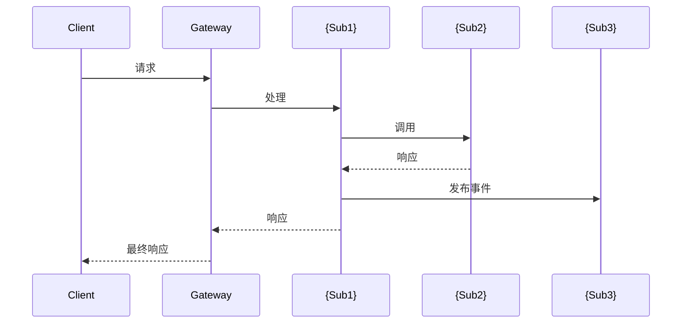

# 子系统识别 - Step 2

## 背景

这是 Porto 工作流的 **Step 2**。它基于以下内容识别子系统：
1. Step 1 的业务理解
2. 知识库引用（来自配置的知识库）

**输入**: `step1_understanding.md`
**输出**: `step2_subsystems.md`

## 指令

### 1. 加载前置条件

1. 从工作流目录读取 `step1_understanding.md`
2. 调用 `knowledge-retrieval` skill 检查现有系统
3. 识别哪些子系统线索匹配现有系统 vs. 需要新建

### 2. 应用分解原则

使用领域驱动设计 (DDD) 原则：

| 原则 | 描述 |
|------|------|
| **限界上下文** | 每个子系统有清晰的边界 |
| **业务能力** | 按业务做什么组织，而非技术层 |
| **高内聚** | 相关功能保持在一起 |
| **低耦合** | 最小化子系统间的依赖 |
| **数据所有权** | 每个子系统拥有其数据 |

### 3. 识别子系统

对每个识别的子系统，定义：

| 属性 | 描述 |
|------|------|
| **名称** | 业务含义名称（如 `imed-process`, `ircs-notice`） |
| **类型** | `existing`（复用）/ `extend`（修改现有）/ `new`（新建） |
| **职责** | 单句描述它做什么 |
| **核心能力** | 业务能力列表 |
| **拥有的数据** | 此子系统拥有的实体 |
| **依赖** | 依赖的其他子系统 |
| **知识库引用** | 类似现有系统的链接（如有） |

### 4. 映射子系统交互

创建交互图显示：
- 同步调用 (REST/gRPC)
- 异步事件 (消息队列)
- 共享数据（如有）

### 5. 生成子系统概览

创建具有以下结构的 `step2_subsystems.md`：

```markdown
# Step 2: 子系统识别

> 📋 工作流 ID: {WORKFLOW_ID}
> 📅 生成时间: {TIMESTAMP}
> 📄 基于: step1_understanding.md

---

## 1. 概述

### 1.1 分解摘要

| 指标 | 值 |
|------|-----|
| 子系统总数 | {N} |
| 新建子系统 | {N} |
| 扩展现有 | {N} |
| 复用现有 | {N} |

### 1.2 系统架构图

```mermaid
graph TB
    subgraph Clients["客户端应用"]
        WEB[Web 应用]
        MOBILE[移动应用]
    end

    subgraph Gateway["API 网关"]
        GW[网关]
    end

    subgraph Services["子系统"]
        {子系统节点}
    end

    subgraph Data["数据层"]
        {数据库节点}
    end

    {连接关系}
```

---

## 2. 子系统定义

<!-- 对每个子系统 -->

### 2.{N} {subsystem_name}

| 属性 | 值 |
|------|-----|
| **类型** | {new/extend/existing} |
| **职责** | {单句描述} |
| **知识库引用** | {链接或"无"} |

#### 业务能力

| 能力 | 描述 | 优先级 |
|------|------|--------|
| ... | ... | P0/P1/P2 |

#### 数据所有权

| 实体 | 操作 | 存储 |
|------|------|------|
| ... | CRUD | 数据库类型 |

#### 依赖

| 依赖 | 类型 | 用途 |
|------|------|------|
| ... | sync/async | ... |

#### 暴露的 API（初步）

| 方法 | 端点 | 描述 |
|------|------|------|
| ... | ... | ... |

#### 事件（初步）

| 事件 | 方向 | 触发条件 |
|------|------|----------|
| ... | 发布/消费 | ... |

<!-- 结束循环 -->

---

## 3. 子系统交互矩阵

| 从 ↓ / 到 → | {sub1} | {sub2} | {sub3} |
|--------------|--------|--------|--------|
| **{sub1}** | - | sync | async |
| **{sub2}** | async | - | sync |
| **{sub3}** | - | - | - |

---

## 4. 交互时序图

### 4.1 {关键业务流程名称}



---

## 5. 知识库引用

### 5.1 匹配的系统

| 子系统 | 匹配的 KB 系统 | 匹配类型 | 复用策略 |
|--------|----------------|----------|----------|
| ... | ... | exact/similar | 参考架构 |

### 5.2 引用详情

<!-- 对每个匹配的系统 -->

#### {kb_system_name}

**位置**: `{kb_path}/{kb_system_name}/`

**适用模式**:
- {模式 1}
- {模式 2}

**参考 API**:
- {API 端点模式}

**考虑的数据模型**:
- {实体结构}

<!-- 结束循环 -->

---

## 6. 技术栈建议

### 6.1 每个子系统的技术栈

| 子系统 | 语言 | 框架 | 数据库 | 消息队列 |
|--------|------|------|--------|----------|
| ... | ... | ... | ... | ... |

### 6.2 共享基础设施

| 组件 | 技术 | 用途 |
|------|------|------|
| API 网关 | Kong/Nginx | 请求路由 |
| 服务发现 | Consul/K8s | 服务注册 |
| 消息队列 | Kafka/RabbitMQ | 异步通信 |
| 缓存 | Redis | 分布式缓存 |

---

## 7. 风险评估

| 风险 | 影响 | 缓解措施 |
|------|------|----------|
| ... | 高/中/低 | ... |

---

## 8. 下一步

审查此文档后：

1. **如需编辑**: `~/.porto/workflows/{WORKFLOW_ID}/step2_subsystems.md`
2. **继续到 Step 3**: 运行 `/porto.continue` 生成详细需求规格
3. **完善子系统**: 调整名称、职责或边界

---

## 附录: 分解理由

### 为什么选择这些边界？

{解释选择这些子系统边界的理由}

### 考虑的替代分解方案

| 方案 | 优点 | 缺点 | 未选择原因 |
|------|------|------|------------|
| ... | ... | ... | ... |
```

## 工作流集成

生成报告后：

1. **更新工作流元数据**:
   ```json
   {
     "current_step": 2,
     "step2_status": "completed",
     "step2_output": "step2_subsystems.md",
     "identified_subsystems": ["imed-process", "ircs-notice", "..."]
   }
   ```

2. **向用户显示摘要**:
   ```
   ✅ Step 2 完成: 子系统识别

   📄 输出: ~/.porto/workflows/{WORKFLOW_ID}/step2_subsystems.md

   摘要:
   - 识别 {N} 个子系统
   - {N} 个新建, {N} 个扩展现有, {N} 个复用
   - 找到 {N} 个知识库引用

   已识别子系统:
   1. imed-process (new) - 订单处理
   2. ircs-notice (extend) - 通知处理
   3. ...

   下一步操作:
   - 查看文档: cat ~/.porto/workflows/{WORKFLOW_ID}/step2_subsystems.md
   - 如需调整子系统名称或边界
   - 继续到 Step 3: /porto.continue
   ```

## 知识库集成

此 skill 应该：

1. **精确匹配优先**: 检查 PRD 是否提及现有系统名称
2. **相似性搜索**: 将业务领域匹配到现有系统
3. **引用提取**: 从匹配系统提取架构模式
4. **差距识别**: 识别现有系统未覆盖的能力
