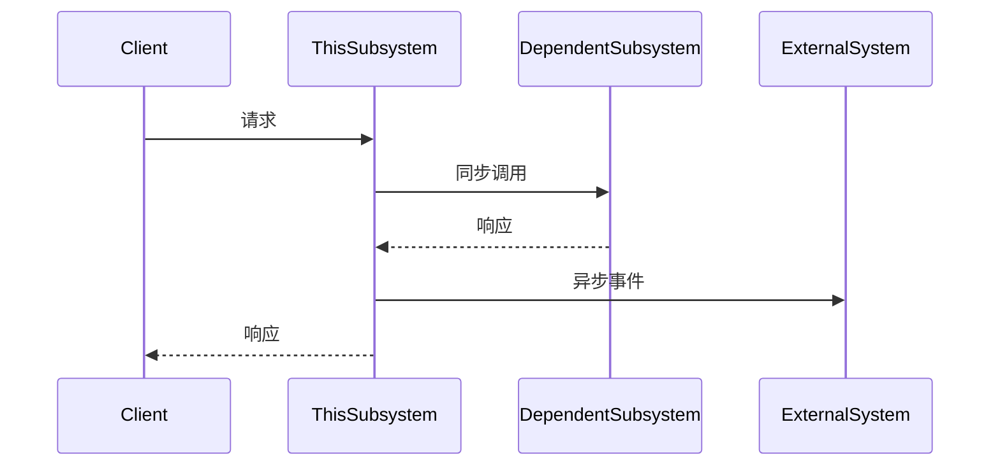

# 子系统规格生成 - Step 3

## 背景

这是 Porto 工作流的 **Step 3**。它为 Step 2 识别的每个子系统生成详细的需求规格。

**输入**: `step1_understanding.md`, `step2_subsystems.md`
**输出**: 每个子系统的 `step3/{subsystem_name}/REQUIREMENTS.md`

## 目的

对每个识别的子系统，生成一个全面的需求文档，包括：
1. **定义** 要实现的业务能力
2. **指定** API 契约
3. **详细说明** 数据模型需求
4. **识别** 集成需求
5. **引用** 配置的知识库中的现有模式（如可用）

## 指令

### 1. 加载前置条件

读取以下文件：
- `step1_understanding.md` - 业务需求和功能
- `step2_subsystems.md` - 子系统定义和边界

### 2. 检查知识库

从 `~/.porto/config.json` 读取知识库配置并搜索匹配的系统。

对每个子系统，检查知识库中是否存在类似系统以获取参考模式。

### 3. 为每个子系统生成规格

对 Step 2 定义的每个子系统，创建专用目录和 REQUIREMENTS.md：

```
step3/
├── {subsystem_1}/
│   └── REQUIREMENTS.md
├── {subsystem_2}/
│   └── REQUIREMENTS.md
└── {subsystem_n}/
    └── REQUIREMENTS.md
```

### 4. REQUIREMENTS.md 模板

```markdown
# {subsystem_name} - 系统需求

> 📋 工作流 ID: {WORKFLOW_ID}
> 📅 生成时间: {TIMESTAMP}
> 📄 来源: step2_subsystems.md
> 🔗 知识库: {匹配的知识库系统链接，或"无"}

---

## 1. 执行摘要

### 1.1 子系统概述

| 属性 | 值 |
|------|-----|
| **名称** | {subsystem_name} |
| **类型** | new / extend / existing |
| **职责** | {来自 Step 2 的单句描述} |
| **负责人** | {建议团队} |

### 1.2 业务背景

{2-3 句话解释为什么存在此子系统及其在整体系统中的角色}

---

## 2. 业务能力

### 2.1 必需能力

| ID | 能力 | 描述 | 优先级 | 来源 (PRD 章节) |
|----|------|------|--------|-----------------|
| BC-001 | {名称} | {功能} | P0/P1/P2 | {引用} |

### 2.2 能力详情

<!-- 对每个能力 -->

#### BC-{N}: {能力名称}

**描述**: {详细描述}

**验收标准**:
- [ ] {标准 1}
- [ ] {标准 2}
- [ ] {标准 3}

**业务规则**:
| 规则 | 描述 |
|------|------|
| BR-{N} | {规则描述} |

<!-- 结束循环 -->

---

## 3. API 需求

### 3.1 API 概述

| 方法 | 端点 | 描述 | 优先级 |
|------|------|------|--------|
| GET | /api/v1/{resource} | {描述} | P0 |
| POST | /api/v1/{resource} | {描述} | P0 |
| PUT | /api/v1/{resource}/{id} | {描述} | P1 |
| DELETE | /api/v1/{resource}/{id} | {描述} | P1 |

### 3.2 API 规格

<!-- 对每个 API 端点 -->

#### {METHOD} {Endpoint}

**用途**: {此 API 做什么}

**请求**:
```json
{
  "field1": "string",
  "field2": "number",
  "field3": {
    "nested": "object"
  }
}
```

**响应**:
```json
{
  "code": 0,
  "data": {
    "id": "string",
    "result": "object"
  },
  "message": "string"
}
```

**错误码**:
| 代码 | 描述 |
|------|------|
| 400 | 请求参数无效 |
| 401 | 未授权 |
| 404 | 资源未找到 |

**业务规则**:
- {规则 1}
- {规则 2}

<!-- 结束循环 -->

---

## 4. 数据模型需求

### 4.1 实体

| 实体 | 描述 | 所有者 |
|------|------|--------|
| {Entity1} | {描述} | 此子系统 |
| {Entity2} | {描述} | 外部（仅引用） |

### 4.2 实体定义

<!-- 对此子系统拥有的每个实体 -->

#### {实体名称}

**描述**: {此实体代表什么}

**属性**:
| 属性 | 类型 | 必需 | 描述 | 约束 |
|------|------|------|------|------|
| id | string | 是 | 唯一标识符 | UUID 格式 |
| name | string | 是 | 显示名称 | 最大 100 字符 |
| createdAt | datetime | 是 | 创建时间戳 | 自动生成 |
| updatedAt | datetime | 是 | 更新时间戳 | 自动更新 |

**关系**:
| 关系 | 目标实体 | 类型 | 描述 |
|------|----------|------|------|
| belongsTo | {Entity} | 多对一 | {描述} |
| hasMany | {Entity} | 一对多 | {描述} |

**索引**:
| 索引 | 字段 | 类型 | 用途 |
|------|------|------|------|
| idx_{name} | {field1, field2} | 唯一/非唯一 | {用途} |

<!-- 结束循环 -->

### 4.3 实体关系图

```mermaid
erDiagram
    {ENTITY_A} ||--o{ {ENTITY_B} : "包含"
    {ENTITY_A} ||--|| {ENTITY_C} : "属于"
```

---

## 5. 集成需求

### 5.1 依赖

| 系统 | 类型 | 用途 | 集成方式 |
|------|------|------|----------|
| {subsystem} | 内部 | {用途} | REST / gRPC / MQ |
| {external} | 外部 | {用途} | REST / Webhook |

### 5.2 事件

#### 发布的事件

| 事件名称 | 触发条件 | 载荷摘要 | 消费者 |
|----------|----------|----------|--------|
| {event.name} | {何时} | {字段} | {子系统} |

#### 消费的事件

| 事件名称 | 来源 | 用途 | 动作 |
|----------|------|------|------|
| {event.name} | {subsystem} | {用途} | {做什么} |

### 5.3 集成时序



---

## 6. 非功能性需求

### 6.1 性能

| 指标 | 需求 | 优先级 |
|------|------|--------|
| 响应时间 | < 200ms (P95) | P0 |
| 吞吐量 | 1000 req/sec | P1 |
| 并发用户 | 10,000 | P1 |

### 6.2 可靠性

| 指标 | 需求 | 优先级 |
|------|------|--------|
| 可用性 | 99.9% | P0 |
| 数据持久性 | 99.999% | P0 |
| 恢复时间 (RTO) | < 5 分钟 | P1 |
| 恢复点 (RPO) | < 1 分钟 | P1 |

### 6.3 安全性

| 需求 | 描述 | 优先级 |
|------|------|--------|
| 身份认证 | JWT / OAuth2 | P0 |
| 授权 | RBAC | P0 |
| 数据加密 | 静态 AES-256, 传输 TLS 1.3 | P0 |
| 审计日志 | 所有数据修改 | P1 |

### 6.4 可扩展性

| 需求 | 描述 | 优先级 |
|------|------|--------|
| 水平扩展 | 支持 Pod 自动扩缩 | P1 |
| 数据库分片 | 支持数据分区 | P2 |

---

## 7. 技术建议

### 7.1 推荐技术栈

| 类别 | 技术 | 理由 |
|------|------|------|
| 语言 | {Go/Java/TypeScript} | {原因} |
| 框架 | {Gin/Spring/Fastify} | {原因} |
| 数据库 | {PostgreSQL/MySQL/MongoDB} | {原因} |
| 缓存 | {Redis} | {原因} |
| 消息队列 | {Kafka/RabbitMQ} | {原因} |

### 7.2 知识库参考

<!-- 如果匹配到知识库中的现有系统 -->

**匹配系统**: `{kb_subsystem_name}`

| 方面 | 参考 |
|------|------|
| 架构 | {kb_path}/{kb_subsystem}/ARCHITECTURE.md |
| API 模式 | {kb_path}/{kb_subsystem}/SUMMARY.md#api-overview |
| 数据模型 | {kb_path}/{kb_subsystem}/SUMMARY.md#data-models |
| 文件结构 | {kb_path}/{kb_subsystem}/FILE_INDEX.md |

**可复用模式**:
- {模式 1}
- {模式 2}

---

## 8. 约束与假设

### 8.1 约束

- {技术约束 1}
- {业务约束 2}

### 8.2 假设

- {假设 1}
- {假设 2}

---

## 9. 待解决问题

| ID | 问题 | 影响 | 负责人 |
|----|------|------|--------|
| Q-001 | {问题} | {对设计的影响} | {询问谁} |

---

## 10. 验收检查清单

在标记此子系统为开发就绪之前：

- [ ] 所有 P0 能力都有详细规格
- [ ] 所有 P0 API 都有请求/响应模式文档
- [ ] 数据模型完整，包含关系
- [ ] 集成点已识别
- [ ] 非功能性需求已量化
- [ ] 待解决问题已解决

---

## 附录: 变更日志

| 日期 | 版本 | 变更 | 作者 |
|------|------|------|------|
| {date} | 1.0 | 初始生成 | Porto |
```

## 工作流集成

生成所有规格后：

1. **更新 workflow.json**:
   ```json
   {
     "current_step": 3,
     "step3_status": "completed",
     "step3_output": "step3/",
     "subsystem_specs": [
       "step3/imed-process/REQUIREMENTS.md",
       "step3/ircs-notice/REQUIREMENTS.md"
     ]
   }
   ```

2. **显示完成摘要**:
   ```
   ✅ Step 3 完成: 子系统规格生成

   📂 输出目录: ~/.porto/workflows/{WORKFLOW_ID}/step3/

   已生成规格:
   ├── imed-process/REQUIREMENTS.md
   │   └── 5 个能力, 12 个 API, 3 个实体
   ├── ircs-notice/REQUIREMENTS.md
   │   └── 3 个能力, 8 个 API, 2 个实体
   └── payment-gateway/REQUIREMENTS.md
       └── 4 个能力, 10 个 API, 4 个实体

   🎉 工作流完成！

   下一步操作:
   • 查看规格: ls ~/.porto/workflows/{WORKFLOW_ID}/step3/
   • 开始每个子系统的开发规划
   • 将规格分配给开发团队
   ```

## 知识库使用

生成规格时，参考配置的知识库：

| 场景 | 操作 |
|------|------|
| **找到精确匹配** | 使用现有模式，适配新需求 |
| **找到类似系统** | 参考架构，修改差异部分 |
| **无匹配** | 使用 DDD 原则从头生成 |

### 从知识库文档提取

**从 README.md**:
- 技术栈建议
- 核心模块模式

**从 SUMMARY.md**:
- API 命名约定
- 数据模型模式
- 功能组织

**从 ARCHITECTURE.md**:
- 分层结构
- 设计模式
- 集成模式

**从 FILE_INDEX.md**:
- 文件组织模式
- 命名约定
