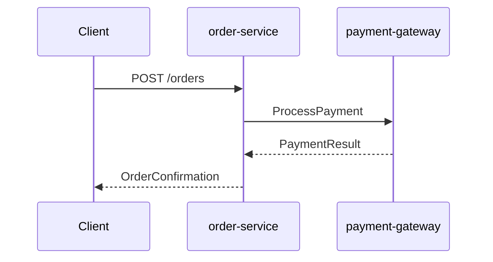
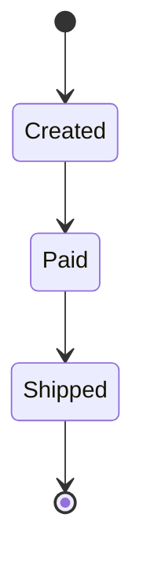

# Context Generation

## Order Flow

```mermaid
sequenceDiagram
    participant Client
    participant Order as order-service
    participant Payment as payment-gateway
    Client->>Order: POST /orders
    Order->>Payment: ProcessPayment
    Payment-->>Order: PaymentResult
    Order-->>Client: OrderConfirmation
```

## Order State Machine

```mermaid
stateDiagram-v2
    [*] --> Created
    Created --> Paid
    Paid --> Shipped
    Shipped --> [*]
```
