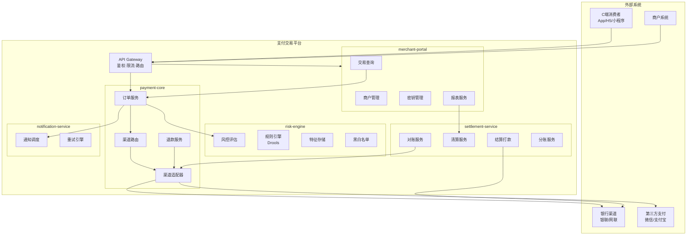
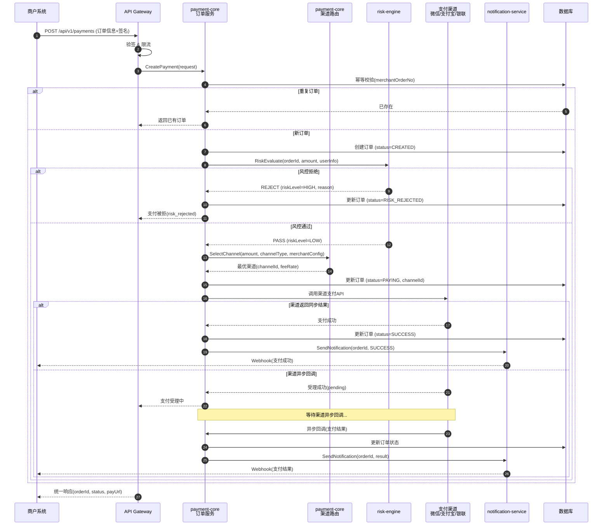
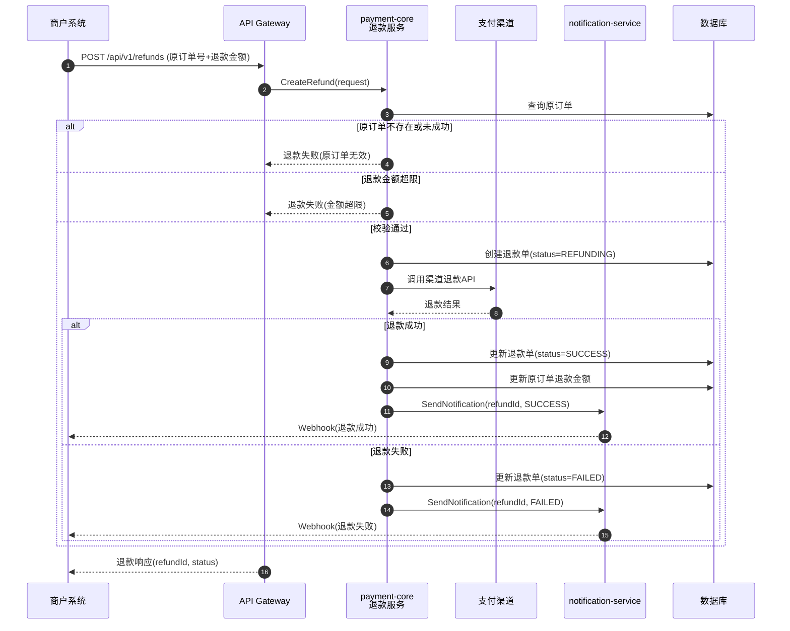
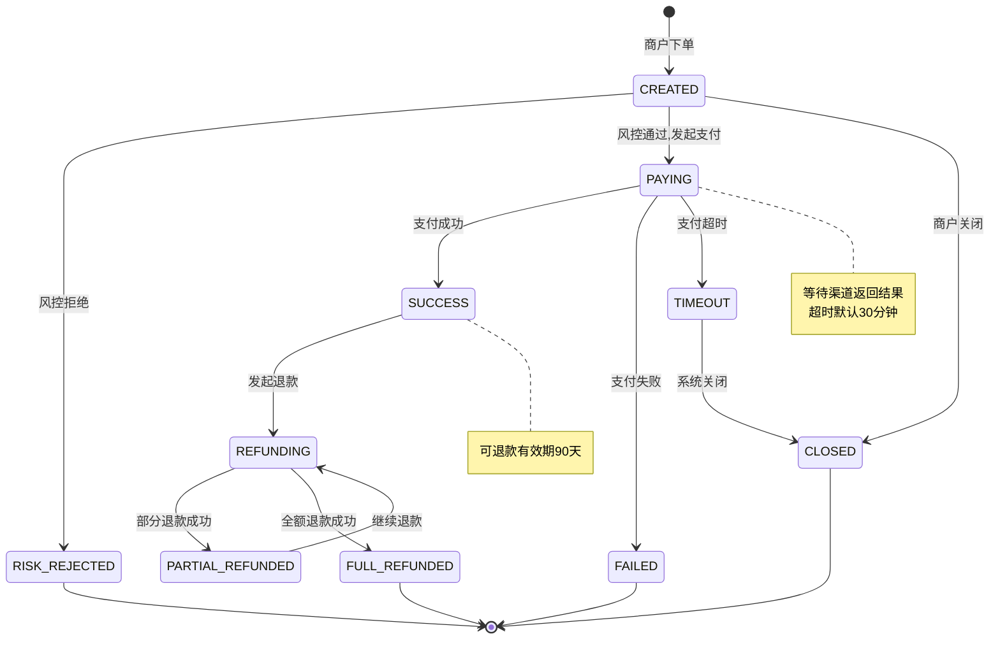
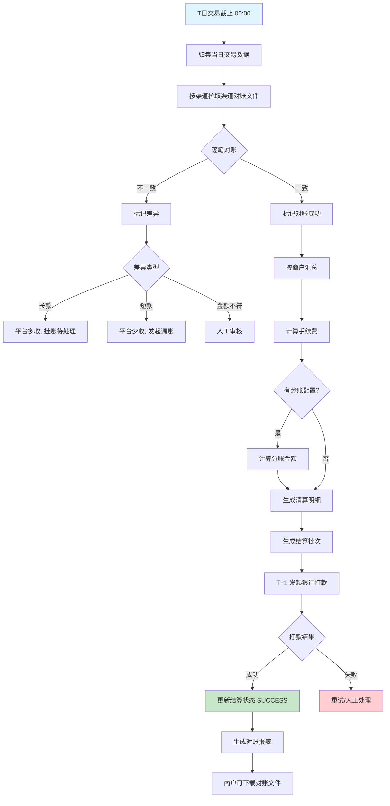
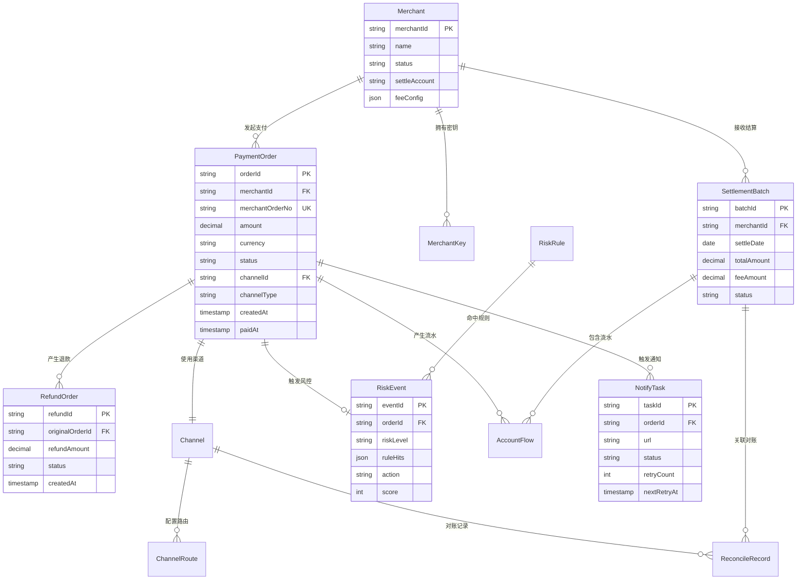

# Step 3: 上下文生成 — 互联网支付交易平台

## 系统架构组件图

## 支付下单全流程时序图

## 退款流程时序图

## 支付订单状态机

## T+1 清结算流程图

## 领域实体关系图

## 事件目录

| 事件名称 | 发布者 | 消费者 | 触发时机 | 载体 |
|----------|--------|--------|----------|------|
| `PaymentCreated` | payment-core | risk-engine | 订单创建后 | Kafka |
| `PaymentSucceeded` | payment-core | settlement-service, notification-service | 支付成功 | Kafka |
| `PaymentFailed` | payment-core | notification-service | 支付失败 | Kafka |
| `RefundSucceeded` | payment-core | settlement-service, notification-service | 退款成功 | Kafka |
| `RiskEvaluated` | risk-engine | payment-core | 风控决策完成 | RPC Response |
| `SettlementCompleted` | settlement-service | notification-service, merchant-portal | 结算打款完成 | Kafka |
| `ReconcileDiffFound` | settlement-service | 运营告警 | 对账发现差异 | Kafka + 钉钉 |

## 集成契约概览

| 接口 | 协议 | 调用方 → 提供方 | 说明 |
|------|------|-----------------|------|
| `POST /api/v1/payments` | REST | merchant → payment-core | 统一下单 |
| `GET /api/v1/payments/{id}` | REST | merchant → payment-core | 订单查询 |
| `POST /api/v1/refunds` | REST | merchant → payment-core | 退款申请 |
| `RiskEvaluate(RiskRequest)` | gRPC | payment-core → risk-engine | 实时风控评估 |
| `SendNotification(NotifyRequest)` | Kafka | payment-core → notification-service | 异步通知 |
| `GetTransactions(QueryRequest)` | gRPC | settlement-service → payment-core | 拉取交易数据 |
| `GET /portal/api/v1/transactions` | REST | merchant-portal → payment-core | 交易查询 |
